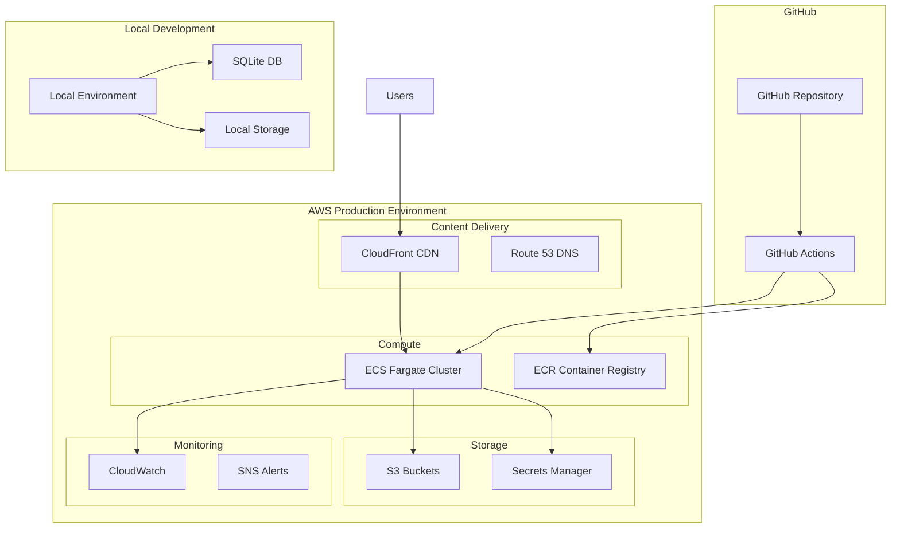

# AWS Production Deployment Design Document

## Overview

This design establishes a cost-effective AWS production architecture for the Children's Drawing Anomaly Detection System while maintaining local development capabilities. The architecture uses ECS Fargate for containerized deployment, S3 for storage, CloudFront for content delivery, and GitHub Actions for automated CI/CD. The system includes usage metrics, a public demo section, and password-protected administrative features.

## Architecture

### High-Level Architecture



### Environment Configuration

The system automatically detects environment context through environment variables:

- **Local Development**: Uses SQLite database and local file storage with hot reloading support
- **Production**: Uses SQLite database with automated S3 backup and S3 for file storage
- **Configuration**: Environment-specific settings loaded from `.env` files with automatic fallback mechanisms
- **Data Isolation**: Strict separation between local development and production data to prevent cross-environment interference

## Components and Interfaces

### 1. GitHub Actions CI/CD Pipeline

**Purpose**: Automated deployment triggered by GitHub events

**Components**:
- Build workflow for Docker image creation
- Test workflow for automated testing
- Deploy workflow for ECS service updates
- Security scanning for container vulnerabilities

**Interfaces**:
- GitHub webhook triggers
- AWS credentials via GitHub Secrets
- ECR push/pull operations
- ECS service deployment API

### 2. ECS Fargate Compute Service

**Purpose**: Serverless container hosting for the application

**Configuration**:
- Task Definition: 0.25 vCPU, 0.5 GB RAM
- Service: Single task for cost optimization
- Auto-scaling: Disabled for demo stage
- Health checks: HTTP endpoint monitoring

**Interfaces**:
- Application Load Balancer (optional future enhancement)
- CloudWatch logging integration
- S3 storage access via IAM roles
- Secrets Manager integration

### 3. Storage Architecture

**S3 Bucket Structure**:
```
production-drawings-bucket/
├── drawings/           # User uploaded drawings
├── models/            # Trained ML models
├── saliency_maps/     # Generated interpretability maps
├── exports/           # Analysis export files
├── backups/           # SQLite database backups
└── demo/              # Sample drawings for demo section
```

### Database Strategy

**Database Architecture**:
- SQLite for application data (simple, cost-effective, suitable for demo workloads)
- Automated S3 backup every 6 hours for data durability
- Point-in-time recovery via timestamped backups
- Alembic integration for version-controlled schema migrations
- Migration rollback support for deployment safety
- Consistent migration application across local development and production environments

### 4. Content Delivery Network

**CloudFront Configuration**:
- Origin: ECS Fargate service
- Caching: Static assets (CSS, JS, images)
- SSL/TLS: Automatic certificate management
- Geographic distribution: Global edge locations

### 5. Authentication Service

**Implementation**:
- Session-based authentication for admin features using secure session management
- Password stored securely in AWS Secrets Manager with proper encryption
- Public access: Demo, Upload, Documentation (no authentication required)
- Protected access: Dashboard, Configuration, Analysis History (password required)

**Security Features**:
- Secure session management with configurable timeouts
- HTTPS enforcement across all connections
- Rate limiting on login attempts to prevent brute force attacks
- Session timeout configuration for security compliance
- Clear access level information and user-friendly login redirects

### 6. Usage Metrics System

**Metrics Collection**:
- Application-level counters for analysis operations with real-time updates
- CloudWatch custom metrics integration for AWS-native monitoring
- User session tracking (anonymized) for privacy compliance
- Performance monitoring (response times, error rates, system health)
- Geographic usage distribution analytics for usage insights

**Dashboard Integration**:
- Real-time metrics display with automatic refresh capabilities
- Historical trend analysis (daily, weekly, monthly views)
- System health indicators (uptime percentage, error rates)
- Geographic usage distribution visualization
- Average processing time tracking for performance optimization

### 7. Cost Optimization Strategy

**Resource Allocation**:
- ECS Fargate: 0.25 vCPU, 0.5 GB RAM (minimal viable configuration)
- Single task deployment for cost-effectiveness during demo stage
- S3 storage class optimization (Standard-IA for infrequent access, Glacier for backups)
- CloudFront free tier utilization where possible

**Cost Monitoring**:
- Target budget: Under $50/month for demo usage (estimated $26-36/month)
- Cost alerts configured at $40 threshold via SNS notifications
- Detailed cost estimation and recommendations for resource optimization
- AWS Free Tier resource utilization where applicable

## Data Models

### Application Metrics Model

```python
class UsageMetrics:
    total_analyses: int
    daily_analyses: int
    weekly_analyses: int
    monthly_analyses: int
    average_processing_time: float
    unique_sessions: int
    error_rate: float
    uptime_percentage: float
    geographic_distribution: Dict[str, int]
```

### Demo Content Model

```python
class DemoSample:
    id: str
    drawing_path: str
    analysis_result: AnalysisResult
    interpretability_data: InterpretabilityResult
    description: str
    age_group: str
    anomaly_score: float
```

### Environment Configuration Model

```python
class EnvironmentConfig:
    environment: Literal["local", "production"]
    database_url: str
    storage_backend: Literal["local", "s3"]
    s3_bucket_name: Optional[str]
    aws_region: Optional[str]
    secret_manager_enabled: bool
    metrics_enabled: bool
```

## Correctness Properties

*A property is a characteristic or behavior that should hold true across all valid executions of a system-essentially, a formal statement about what the system should do. Properties serve as the bridge between human-readable specifications and machine-verifiable correctness guarantees.*

### Property 1: Environment Configuration Detection
*For any* environment variable configuration, the system should automatically detect and use the appropriate storage backend (SQLite+local for development, SQLite+S3 for production)
**Validates: Requirements 1.1, 1.2, 1.3**

### Property 2: Environment Data Isolation
*For any* data operation performed in different environments, local development data should never interfere with production data
**Validates: Requirements 1.4**

### Property 3: Infrastructure Deployment Reproducibility
*For any* Infrastructure as Code deployment, destroying and recreating the infrastructure should result in functionally equivalent AWS resources
**Validates: Requirements 2.2, 2.4, 2.5**

### Property 4: Automated Deployment Trigger Consistency
*For any* code push to the main branch, the deployment pipeline should automatically trigger and produce consistent deployment results
**Validates: Requirements 3.1, 3.2, 3.4**

### Property 5: Zero-Downtime Deployment Guarantee
*For any* deployment execution, the system should maintain service availability and perform health-check-based rollback on failure
**Validates: Requirements 3.4, 3.5**

### Property 6: Authentication Access Control
*For any* user request to protected resources (dashboard, configuration), access should be granted if and only if valid authentication credentials are provided
**Validates: Requirements 12.2, 12.4, 12.5**

### Property 7: Public Access Availability
*For any* user request to public resources (demo, upload, documentation), access should be granted without authentication requirements
**Validates: Requirements 12.1**

### Property 8: Usage Metrics Accuracy
*For any* application operation that generates metrics, the recorded metrics should accurately reflect the actual system behavior within acceptable measurement tolerances
**Validates: Requirements 10.1, 10.2, 10.3, 10.4, 10.5**

### Property 9: Database Migration Consistency
*For any* database schema change, applying migrations in both local and production environments should result in identical database schemas
**Validates: Requirements 6.2, 6.3, 6.5**

### Property 10: Security Configuration Enforcement
*For any* AWS resource deployment, security controls should enforce least-privilege IAM permissions and encryption for data at rest and in transit
**Validates: Requirements 7.2, 7.3, 7.4, 7.5**

### Property 11: Cost Boundary Compliance
*For any* 30-day operational period, total AWS resource costs should remain within the target budget of $26-36/month for demo usage
**Validates: Requirements 8.4, 9.3**

### Property 12: Monitoring and Alerting Reliability
*For any* system error or performance issue, appropriate alerts should be generated and logs should be collected with proper correlation IDs
**Validates: Requirements 5.1, 5.3, 5.5**

### Property 13: Backup and Recovery Integrity
*For any* SQLite database backup operation to S3, the backup should be restorable to a functionally equivalent database state
**Validates: Requirements 4.2, 6.4**

### Property 14: Demo Content Completeness
*For any* demo section access, all required content (sample drawings, analysis results, project description, warnings, GitHub link) should be available and properly displayed
**Validates: Requirements 11.1, 11.2, 11.3, 11.4, 11.5**

## Error Handling

### Deployment Failures
- **Build Failures**: GitHub Actions workflow stops, notifications sent
- **Health Check Failures**: Automatic rollback to previous version
- **Resource Provisioning Errors**: CloudFormation rollback with detailed logging

### Runtime Errors
- **Database Connection Issues**: Graceful degradation with error messages
- **S3 Access Failures**: Fallback to local storage with warnings
- **Authentication Service Outages**: Temporary public access with notifications

### Monitoring and Alerting
- **CloudWatch Alarms**: CPU, memory, error rate thresholds
- **SNS Notifications**: Email alerts for critical issues
- **Cost Alerts**: Budget threshold notifications at $40/month

## Testing Strategy

### Unit Testing
- **Environment Configuration**: Test local vs production config loading
- **Authentication Logic**: Test password verification and session management
- **Metrics Collection**: Test counter increments and data aggregation
- **Demo Content**: Test sample data loading and display

### Property-Based Testing
- **Infrastructure Deployment**: Test resource creation/destruction cycles
- **Authentication Access Control**: Test various credential combinations
- **Metrics Accuracy**: Test metric calculations across different usage patterns
- **Cost Compliance**: Test resource allocation within budget constraints
- **Database Migration**: Test schema changes across environments

### Integration Testing
- **GitHub Actions Pipeline**: End-to-end deployment testing
- **AWS Service Integration**: Test ECS, S3, CloudFront connectivity
- **Authentication Flow**: Test login/logout across different user types
- **Demo Section**: Test public access and content delivery

### Load Testing
- **Single Instance Performance**: Test application under expected demo load
- **Cost Impact**: Monitor AWS costs during sustained usage
- **Database Performance**: Test SQLite performance with concurrent users

The testing approach combines unit tests for specific functionality with property-based tests for universal behaviors, ensuring both concrete correctness and general system properties are validated.