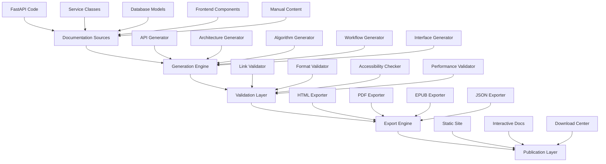

# Comprehensive Documentation System Design

## Overview

This design document specifies the implementation of a comprehensive documentation system for the Children's Drawing Anomaly Detection System. The system will implement industry-standard formats including C4 Model architecture diagrams, OpenAPI 3.0 API documentation, BPMN 2.0 workflow diagrams, UML 2.5 interface specifications, and IEEE-compliant algorithm documentation. The system emphasizes automation, quality assurance, and multi-format export capabilities.

## Architecture

### High-Level Architecture

The documentation system follows a layered architecture with clear separation of concerns:



### System Boundaries

The documentation system operates within the following boundaries:

- **Input Sources**: FastAPI applications, Python services, React components, database models, manual content
- **Processing**: Automated extraction, validation, transformation, and generation
- **Output Formats**: HTML, PDF, EPUB, JSON, interactive web interfaces
- **Integration Points**: Git hooks, CI/CD pipelines, development workflows

## Components and Interfaces

### Core Components

#### 1. Documentation Generation Engine

**Purpose**: Central orchestrator for all documentation generation activities.

**Responsibilities**:
- Coordinate generation across all documentation types
- Manage dependencies between documentation components
- Handle incremental updates and change detection
- Provide unified API for generation operations

**Interface**:
```python
class DocumentationEngine:
    def generate_all(self) -> GenerationResult
    def generate_category(self, category: DocumentationType) -> GenerationResult
    def validate_sources(self) -> ValidationResult
    def detect_changes(self) -> ChangeSet
```

#### 2. Architecture Documentation Generator

**Purpose**: Generate C4 Model architecture documentation from codebase analysis.

**Responsibilities**:
- Extract system context from configuration and dependencies
- Generate container diagrams from service definitions
- Create component diagrams from service relationships
- Generate code diagrams from class structures

**Interface**:
```python
class ArchitectureGenerator:
    def generate_system_context(self) -> C4Diagram
    def generate_container_diagram(self) -> C4Diagram
    def generate_component_diagram(self, service: str) -> C4Diagram
    def generate_code_diagram(self, module: str) -> C4Diagram
```

#### 3. API Documentation Generator

**Purpose**: Generate OpenAPI 3.0 compliant documentation from FastAPI applications.

**Responsibilities**:
- Extract OpenAPI schema from FastAPI applications
- Generate interactive Swagger UI documentation
- Create endpoint-specific documentation with examples
- Validate API documentation against implementation

**Interface**:
```python
class APIDocumentationGenerator:
    def extract_openapi_schema(self) -> OpenAPISchema
    def generate_swagger_ui(self) -> HTMLDocument
    def generate_endpoint_docs(self) -> List[EndpointDoc]
    def validate_api_docs(self) -> ValidationResult
```

#### 4. Algorithm Documentation Generator

**Purpose**: Generate IEEE-compliant algorithm documentation with mathematical specifications.

**Responsibilities**:
- Extract algorithm descriptions from docstrings
- Generate mathematical formulations using LaTeX
- Create performance analysis documentation
- Generate validation and testing specifications

**Interface**:
```python
class AlgorithmGenerator:
    def extract_algorithms(self) -> List[Algorithm]
    def generate_mathematical_spec(self, algorithm: Algorithm) -> MathSpec
    def generate_performance_analysis(self, algorithm: Algorithm) -> PerformanceDoc
    def generate_validation_spec(self, algorithm: Algorithm) -> ValidationDoc
```

#### 5. Workflow Documentation Generator

**Purpose**: Generate BPMN 2.0 compliant workflow diagrams for business and technical processes.

**Responsibilities**:
- Extract workflow patterns from code and configuration
- Generate BPMN diagrams for user journeys
- Create technical process flow diagrams
- Document error handling and recovery processes

**Interface**:
```python
class WorkflowGenerator:
    def generate_user_journey(self, journey: str) -> BPMNDiagram
    def generate_technical_process(self, process: str) -> BPMNDiagram
    def generate_integration_flow(self, integration: str) -> BPMNDiagram
    def generate_error_handling(self, process: str) -> BPMNDiagram
```

#### 6. Interface Documentation Generator

**Purpose**: Generate UML 2.5 compliant interface documentation and contracts.

**Responsibilities**:
- Extract service interfaces from type annotations
- Generate sequence diagrams for interactions
- Create class diagrams for data models
- Generate component diagrams for system structure

**Interface**:
```python
class InterfaceGenerator:
    def generate_service_contracts(self) -> List[ServiceContract]
    def generate_sequence_diagram(self, interaction: str) -> UMLDiagram
    def generate_class_diagram(self, module: str) -> UMLDiagram
    def generate_component_diagram(self) -> UMLDiagram
```

#### 7. Validation Engine

**Purpose**: Comprehensive validation of generated documentation for accuracy and quality.

**Responsibilities**:
- Validate technical accuracy against implementation
- Check link integrity and accessibility
- Verify formatting and style compliance
- Ensure accessibility standards compliance

**Interface**:
```python
class ValidationEngine:
    def validate_technical_accuracy(self, doc: Document) -> ValidationResult
    def validate_links(self, doc: Document) -> LinkValidationResult
    def validate_accessibility(self, doc: Document) -> AccessibilityResult
    def validate_performance(self, site: DocumentationSite) -> PerformanceResult
```

#### 8. Export Engine

**Purpose**: Multi-format export capabilities for generated documentation.

**Responsibilities**:
- Generate HTML with interactive navigation and search
- Create properly formatted PDF documents
- Generate EPUB e-book format
- Maintain consistency across all formats

**Interface**:
```python
class ExportEngine:
    def export_html(self, docs: DocumentSet) -> HTMLSite
    def export_pdf(self, docs: DocumentSet) -> PDFDocument
    def export_epub(self, docs: DocumentSet) -> EPUBDocument
    def export_json(self, docs: DocumentSet) -> JSONExport
```

### Integration Interfaces

#### Git Integration

**Purpose**: Integrate with version control for automated documentation updates.

**Hooks**:
- Pre-commit: Validate documentation changes
- Post-commit: Trigger incremental documentation generation
- Pre-push: Ensure documentation is up-to-date

#### CI/CD Integration

**Purpose**: Integrate with continuous integration and deployment pipelines.

**Stages**:
- Build: Generate documentation as part of build process
- Test: Validate documentation quality and accuracy
- Deploy: Publish documentation to hosting platforms

## Data Models

### Documentation Metadata

```python
@dataclass
class DocumentMetadata:
    title: str
    description: str
    version: str
    last_updated: datetime
    authors: List[str]
    tags: List[str]
    source_files: List[Path]
    dependencies: List[str]
```

### Generation Configuration

```python
@dataclass
class GenerationConfig:
    output_directory: Path
    formats: List[ExportFormat]
    validation_rules: ValidationRules
    template_settings: TemplateSettings
    automation_settings: AutomationSettings
```

### Validation Results

```python
@dataclass
class ValidationResult:
    is_valid: bool
    errors: List[ValidationError]
    warnings: List[ValidationWarning]
    metrics: ValidationMetrics
    recommendations: List[str]
```

### Export Formats

```python
class ExportFormat(Enum):
    HTML = "html"
    PDF = "pdf"
    EPUB = "epub"
    JSON = "json"
    MARKDOWN = "markdown"
```

## Correctness Properties

*A property is a characteristic or behavior that should hold true across all valid executions of a system-essentially, a formal statement about what the system should do. Properties serve as the bridge between human-readable specifications and machine-verifiable correctness guarantees.*

### Property Reflection

After reviewing all properties identified in the prework analysis, several areas of redundancy and consolidation opportunities were identified:

**Redundancy Analysis**:
- Properties 1.1-1.4 (C4 diagram generation) can be consolidated into a single comprehensive C4 generation property
- Properties 2.1-2.5 (API documentation) can be combined into a comprehensive API documentation property
- Properties 3.1-3.5 (workflow documentation) can be consolidated into a single workflow generation property
- Properties 4.1-4.5 (algorithm documentation) can be combined into a comprehensive algorithm documentation property
- Properties 5.1-5.5 (interface documentation) can be consolidated into a single interface documentation property
- Properties 6.1-6.5 (automation) can be combined into a comprehensive automation property
- Properties 7.1-7.5 (export formats) can be consolidated into a single multi-format export property
- Properties 8.1-8.5 (validation) can be combined into a comprehensive validation property

**Consolidated Properties**:

Property 1: Complete C4 Architecture Generation
*For any* system codebase, the Documentation System should generate complete C4 model documentation including system context (Level 1), container diagrams (Level 2), component diagrams (Level 3), and code diagrams (Level 4) that accurately represent the system structure and maintain consistency across all levels
**Validates: Requirements 1.1, 1.2, 1.3, 1.4, 1.5**

Property 2: Comprehensive API Documentation Generation
*For any* FastAPI application, the Documentation System should generate OpenAPI 3.0 compliant specifications with interactive Swagger UI, complete request/response examples, authentication requirements, and error specifications that automatically update when API schemas change
**Validates: Requirements 2.1, 2.2, 2.3, 2.4, 2.5**

Property 3: Complete Workflow Documentation Generation
*For any* business or technical process, the Documentation System should generate BPMN 2.0 compliant workflow diagrams including user journeys, technical processes, integration flows, and error handling that maintain consistency when processes change
**Validates: Requirements 3.1, 3.2, 3.3, 3.4, 3.5**

Property 4: Comprehensive Algorithm Documentation Generation
*For any* algorithm implementation, the Documentation System should generate IEEE-compliant mathematical formulations, computational complexity analysis, performance benchmarks, validation methodologies, and properly rendered LaTeX notation that stays synchronized with code changes
**Validates: Requirements 4.1, 4.2, 4.3, 4.4, 4.5**

Property 5: Complete Interface Documentation Generation
*For any* system interface, the Documentation System should generate UML 2.5 compliant service contracts, sequence diagrams, class diagrams, and component diagrams that accurately represent system interactions and validate against implementation
**Validates: Requirements 5.1, 5.2, 5.3, 5.4, 5.5**

Property 6: Comprehensive Automation and Validation
*For any* code change or documentation generation request, the Documentation System should automatically regenerate affected sections, validate all links and references, check formatting and accessibility compliance, and provide clear error messages with rollback capabilities when automation fails
**Validates: Requirements 6.1, 6.2, 6.3, 6.4, 6.5**

Property 7: Multi-Format Export Consistency
*For any* documentation content, the Documentation System should generate HTML with interactive navigation, properly formatted PDFs with table of contents, EPUB compatible with standard readers, and maintain formatting consistency while preserving diagrams and mathematical notation across all supported formats
**Validates: Requirements 7.1, 7.2, 7.3, 7.4, 7.5**

Property 8: Comprehensive Quality Assurance
*For any* generated documentation, the Documentation System should validate technical accuracy against implementation, verify link accessibility, ensure WCAG 2.1 AA compliance, confirm performance requirements are met, and provide detailed reports with specific issues and fixes when validation fails
**Validates: Requirements 8.1, 8.2, 8.3, 8.4, 8.5**

## Error Handling

### Error Categories

#### Generation Errors
- **Source Code Parsing Errors**: Handle malformed code or missing dependencies
- **Template Rendering Errors**: Manage template syntax errors or missing variables
- **Diagram Generation Errors**: Handle diagram rendering failures or invalid syntax

#### Validation Errors
- **Link Validation Errors**: Handle broken internal and external links
- **Format Validation Errors**: Manage invalid markup or structure
- **Accessibility Errors**: Handle WCAG compliance failures

#### Export Errors
- **Format Conversion Errors**: Handle failures in PDF, EPUB, or other format generation
- **File System Errors**: Manage permission issues or disk space problems
- **Network Errors**: Handle failures in external resource access

### Error Recovery Strategies

#### Graceful Degradation
- Continue generation with warnings for non-critical errors
- Provide placeholder content for failed components
- Generate partial documentation when complete generation fails

#### Rollback Mechanisms
- Maintain backup of previous documentation versions
- Provide rollback capability when generation fails
- Preserve working documentation during updates

#### Error Reporting
- Generate detailed error reports with specific issues
- Provide actionable recommendations for fixing errors
- Include context and stack traces for debugging

## Testing Strategy

### Dual Testing Approach

The documentation system requires both unit testing and property-based testing to ensure comprehensive coverage and correctness.

#### Unit Testing Requirements

Unit tests will verify specific examples, edge cases, and error conditions:

**Generation Components**:
- Test individual generator components with known inputs
- Verify correct handling of edge cases (empty files, malformed code)
- Test error conditions and recovery mechanisms

**Validation Components**:
- Test link validation with various URL formats
- Verify accessibility checking with known compliant/non-compliant content
- Test performance validation with different site sizes

**Export Components**:
- Test format conversion with sample documents
- Verify consistency across different export formats
- Test handling of complex content (diagrams, math notation)

#### Property-Based Testing Requirements

Property-based tests will verify universal properties across all inputs using **Hypothesis** as the property-based testing library. Each property-based test will run a minimum of 100 iterations to ensure comprehensive coverage.

**Property Test Implementation**:
- Each correctness property will be implemented as a single property-based test
- Tests will be tagged with comments referencing the design document property
- Tag format: `**Feature: comprehensive-documentation, Property {number}: {property_text}**`

**Test Categories**:
- **Generation Properties**: Verify that generated documentation contains required elements
- **Validation Properties**: Ensure validation processes correctly identify issues
- **Export Properties**: Confirm format consistency and content preservation
- **Automation Properties**: Verify automatic updates and change detection

### Testing Framework Integration

**Unit Testing Framework**: pytest with fixtures for test data management
**Property-Based Testing Framework**: Hypothesis for generating test inputs
**Integration Testing**: Docker-based testing for full system validation
**Performance Testing**: Custom benchmarking for documentation site performance

## Implementation Notes

### Technology Stack

**Core Technologies**:
- **Python 3.11+**: Primary implementation language
- **FastAPI**: Source for API documentation generation
- **Mermaid**: Diagram generation and visualization
- **LaTeX**: Mathematical notation rendering
- **Pandoc**: Multi-format document conversion

**Documentation Tools**:
- **MkDocs**: Static site generation
- **Swagger UI**: Interactive API documentation
- **PlantUML**: UML diagram generation
- **BPMN.io**: Business process modeling

**Validation Tools**:
- **Accessibility**: axe-core for WCAG compliance
- **Performance**: Lighthouse for site performance
- **Links**: Custom link checker for validation
- **Formatting**: Prettier and markdownlint for consistency

### Automation Integration

**Git Hooks**:
- Pre-commit: Validate documentation changes
- Post-commit: Trigger incremental generation
- Pre-push: Ensure documentation completeness

**CI/CD Pipeline**:
- Build stage: Generate documentation
- Test stage: Validate quality and accuracy
- Deploy stage: Publish to hosting platforms

**Monitoring**:
- Track documentation coverage metrics
- Monitor generation performance
- Alert on validation failures