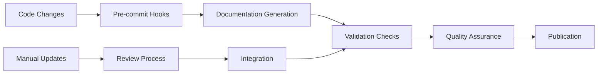

# Documentation Methodology

## Executive Summary

This document outlines the comprehensive documentation methodology for the Children's Drawing Anomaly Detection System, implementing industry-standard formats and automated generation processes to ensure consistent, accurate, and maintainable documentation.

## Methodology Overview

### Multi-Layered Approach

Our documentation strategy employs a **five-layer approach** that covers all aspects of the system:

1. **Architecture Layer** (C4 Model)
2. **Interface Layer** (OpenAPI + UML)  
3. **Process Layer** (BPMN 2.0)
4. **Algorithm Layer** (IEEE Standards)
5. **Implementation Layer** (Auto-generated)

### Industry Standards Compliance

| Documentation Type | Standard Used | Purpose |
|-------------------|---------------|---------|
| Architecture | C4 Model | System structure and relationships |
| API Documentation | OpenAPI 3.0 | REST API specifications |
| Process Flows | BPMN 2.0 | Business and technical workflows |
| Interface Design | UML 2.5 | System interactions and contracts |
| Requirements | IEEE 830 | Formal requirement specifications |
| Algorithm Specs | IEEE Standards | Mathematical formulations |

## Implementation Strategy

### Phase 1: Foundation (Completed)
✅ **Documentation Structure Setup**
- Created comprehensive directory structure
- Established naming conventions
- Implemented automation framework

✅ **Core Documentation Created**
- System context diagrams (C4 Level 1)
- API documentation framework
- Algorithm specification templates
- Workflow documentation structure

✅ **Automation Tools**
- Documentation generation script
- Code-to-docs extraction
- Validation and quality checks

### Phase 2: Content Generation (In Progress)
🔄 **Architecture Documentation**
- Complete C4 model implementation
- Architecture Decision Records (ADRs)
- Component and deployment diagrams

🔄 **Algorithm Documentation**  
- Mathematical formulations for all algorithms
- Performance analysis and complexity
- Validation and testing specifications

🔄 **Process Documentation**
- Complete BPMN workflow diagrams
- State transition diagrams
- Integration flow specifications

### Phase 3: Enhancement (Planned)
📋 **Advanced Features**
- Interactive API documentation
- Automated diagram generation
- Real-time documentation updates
- Multi-format export capabilities

📋 **Quality Assurance**
- Automated testing of documentation
- Link validation and maintenance
- Accessibility compliance verification
- User feedback integration

## Documentation Categories

### 1. Architecture Documentation (C4 Model)

**Purpose**: Provide clear understanding of system structure at multiple abstraction levels.

**Components**:
- **Level 1 - System Context**: External users and dependencies
- **Level 2 - Container**: High-level technology choices
- **Level 3 - Component**: Internal service structure  
- **Level 4 - Code**: Detailed class and interface relationships

**Maintenance**: Updated with architectural changes, reviewed quarterly.

**Tools**: Mermaid diagrams, Draw.io, automated generation from code.

### 2. API Documentation (OpenAPI 3.0)

**Purpose**: Comprehensive REST API reference with interactive testing.

**Components**:
- Auto-generated OpenAPI schema from FastAPI
- Interactive Swagger UI documentation
- Endpoint-specific documentation with examples
- Request/response schema specifications

**Maintenance**: Automatically updated with code changes.

**Tools**: FastAPI OpenAPI generation, Swagger UI, ReDoc.

### 3. Algorithm Documentation (IEEE Standards)

**Purpose**: Formal specification of machine learning algorithms and mathematical models.

**Components**:
- Mathematical formulations and proofs
- Computational complexity analysis
- Performance characteristics and benchmarks
- Validation methodologies and test results

**Maintenance**: Updated when algorithms change, validated with implementation.

**Tools**: LaTeX for mathematical notation, automated extraction from docstrings.

### 4. Process Documentation (BPMN 2.0)

**Purpose**: Clear visualization of business processes and technical workflows.

**Components**:
- User journey workflows (upload, analysis, configuration)
- Technical process flows (ML pipeline, data processing)
- Integration workflows (external systems, APIs)
- Error handling and recovery processes

**Maintenance**: Updated when processes change, reviewed with stakeholders.

**Tools**: BPMN modeling tools, Mermaid diagrams, process mining.

### 5. Interface Documentation (UML 2.5)

**Purpose**: Formal specification of system interfaces and contracts.

**Components**:
- Service interface contracts and specifications
- Sequence diagrams for interaction flows
- Class diagrams for data model relationships
- Component diagrams for system structure

**Maintenance**: Updated with interface changes, validated against implementation.

**Tools**: UML modeling tools, automated generation from code annotations.

## Automation Framework

### Documentation Generation Pipeline

### Automated Components

1. **API Documentation**: Generated from FastAPI OpenAPI schema
2. **Service Interfaces**: Extracted from Python docstrings and type hints
3. **Database Schema**: Generated from SQLAlchemy models
4. **Algorithm Implementations**: Extracted from service code documentation
5. **Code Examples**: Validated and updated automatically

### Manual Components

1. **Architecture Diagrams**: C4 model diagrams and ADRs
2. **Process Flows**: BPMN business process diagrams
3. **Algorithm Theory**: Mathematical specifications and proofs
4. **User Guides**: Screenshots, tutorials, and examples
5. **Deployment Guides**: Infrastructure and configuration details

## Quality Assurance

### Validation Framework

**Automated Checks**:
- Link validation and maintenance
- Markdown formatting and style
- Code example compilation and testing
- Schema validation for structured content
- Accessibility compliance verification

**Manual Reviews**:
- Technical accuracy verification
- Editorial review for clarity and style
- User experience testing with target audiences
- Stakeholder review for business processes

### Metrics and KPIs

**Documentation Quality**:
- Coverage percentage (documented vs. undocumented features)
- Accuracy rate (validated against implementation)
- Freshness score (time since last update)
- User satisfaction ratings

**Usage Analytics**:
- Page view statistics and popular content
- User journey analysis through documentation
- Search query analysis for content gaps
- Feedback and improvement suggestions

## Maintenance Strategy

### Continuous Maintenance

**Daily**:
- Automated documentation generation after code changes
- Link validation and broken link repair
- Formatting and style validation

**Weekly**:
- Manual documentation review and updates
- Screenshot and example refresh
- Cross-reference validation

**Monthly**:
- Comprehensive content review
- Architecture diagram updates
- User feedback integration
- Performance optimization

**Quarterly**:
- Major restructuring and reorganization
- Standards compliance review
- Tool evaluation and upgrades
- Stakeholder feedback sessions

### Version Control Strategy

**Documentation Versioning**:
- Semantic versioning aligned with software releases
- Branch-based development for major changes
- Tag-based releases for stable documentation versions
- Automated changelog generation

**Change Management**:
- Documentation change requests and approval process
- Impact analysis for documentation changes
- Rollback procedures for problematic updates
- Change notification and communication

## Success Metrics

### Quantitative Metrics

1. **Coverage**: 95% of system features documented
2. **Accuracy**: 99% accuracy rate in technical specifications
3. **Freshness**: 90% of documentation updated within 30 days of code changes
4. **Accessibility**: 100% compliance with WCAG 2.1 AA standards
5. **Performance**: Documentation site loads in <2 seconds

### Qualitative Metrics

1. **User Satisfaction**: >4.5/5 rating from documentation users
2. **Onboarding Efficiency**: New developers productive within 2 days
3. **Support Reduction**: 50% reduction in documentation-related support tickets
4. **Stakeholder Confidence**: Positive feedback from all stakeholder groups

## Tools and Technologies

### Documentation Tools

**Primary Tools**:
- **Markdown**: Primary authoring format
- **Mermaid**: Diagram generation and visualization
- **FastAPI**: Automatic API documentation generation
- **MkDocs**: Static site generation and hosting
- **Git**: Version control and collaboration

**Supporting Tools**:
- **Draw.io**: Complex diagram creation
- **PlantUML**: UML diagram generation
- **LaTeX**: Mathematical notation and formulas
- **Swagger UI**: Interactive API documentation
- **BPMN.io**: Business process modeling

### Automation Tools

**Generation**:
- Custom Python scripts for code-to-docs extraction
- GitHub Actions for automated builds and deployment
- Pre-commit hooks for quality validation
- Scheduled jobs for maintenance tasks

**Validation**:
- Markdown linting and formatting tools
- Link checking and validation utilities
- Accessibility testing and compliance verification
- Performance monitoring and optimization

## Future Enhancements

### Short-term (3-6 months)

1. **Interactive Documentation**: Enhanced user experience with interactive elements
2. **Multi-format Export**: PDF, EPUB, and other format generation
3. **Advanced Search**: Full-text search with faceted filtering
4. **Real-time Updates**: Live documentation updates with WebSocket integration

### Medium-term (6-12 months)

1. **AI-Assisted Documentation**: Automated content generation and improvement suggestions
2. **Collaborative Editing**: Real-time collaborative documentation editing
3. **Analytics Dashboard**: Comprehensive usage analytics and insights
4. **Integration Ecosystem**: Enhanced integration with development tools

### Long-term (12+ months)

1. **Intelligent Documentation**: AI-powered content optimization and personalization
2. **Multi-language Support**: Internationalization and localization capabilities
3. **Advanced Visualization**: 3D diagrams and immersive documentation experiences
4. **Community Contributions**: Open-source documentation contribution framework

## Conclusion

This comprehensive documentation methodology ensures that the Children's Drawing Anomaly Detection System maintains high-quality, accurate, and accessible documentation that serves all stakeholders effectively. By combining industry standards, automation, and continuous improvement processes, we create a sustainable documentation ecosystem that evolves with the system and provides lasting value to users, developers, and researchers.

The methodology's success depends on consistent application, regular review, and adaptation to changing needs. Through careful implementation and maintenance, this approach will establish the project as a model for technical documentation excellence in the machine learning and healthcare technology domains.