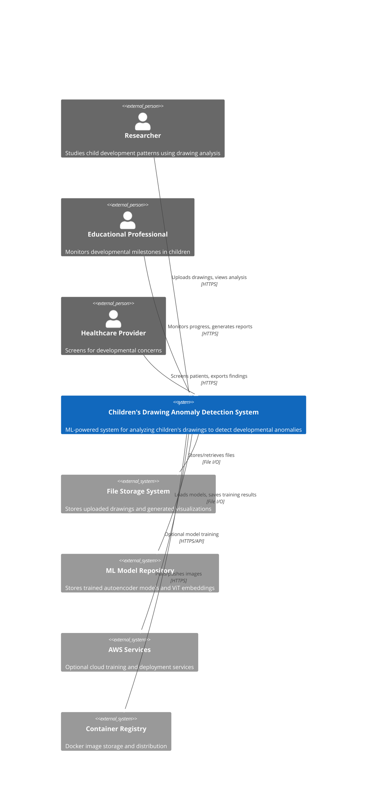

# System Context Diagram (C4 Level 1)

## Overview

ML-powered system for analyzing children's drawings to detect developmental anomalies

## System Context

## Legend

- **Person (Blue)**: External users of the system
- **System (Red)**: The main system being documented  
- **External System (Gray)**: External dependencies
- **Relationship (Arrow)**: Interaction between elements

## Diagram Validation

## System Users

### Researcher
Primary user type interacting with the Children's Drawing Anomaly Detection System.

### Educational Professional
Primary user type interacting with the Children's Drawing Anomaly Detection System.

### Healthcare Provider
Primary user type interacting with the Children's Drawing Anomaly Detection System.

## External Systems

### File Storage System
External dependency providing services to the main system.

### ML Model Repository
External dependency providing services to the main system.

### AWS Services
External dependency providing services to the main system.

### Container Registry
External dependency providing services to the main system.

