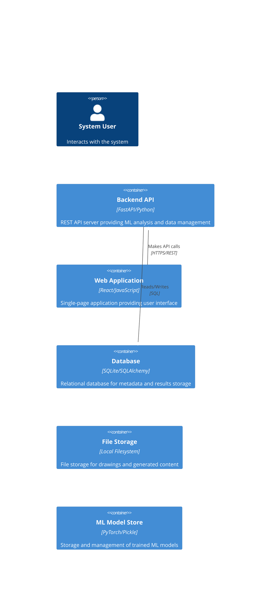

# Container Diagram (C4 Level 2)

## Overview

This diagram shows the high-level technology choices and how responsibilities are distributed across containers.

## Container Architecture

## Legend

- **Person (Blue)**: System users
- **Container (Green)**: Deployable/executable units
- **Database (Yellow)**: Data storage containers
- **Relationship (Arrow)**: Communication between containers
## Container Details

### Backend API

**Technology**: FastAPI/Python

**Description**: REST API server providing ML analysis and data management

**Key Responsibilities**:
- Drawing upload and processing
- ML model inference
- Anomaly detection scoring
- Data persistence

### Web Application

**Technology**: React/JavaScript

**Description**: Single-page application providing user interface

**Key Responsibilities**:
- Drawing upload interface
- Analysis results visualization
- Configuration management
- Dashboard and reporting

### Database

**Technology**: SQLite/SQLAlchemy

**Description**: Relational database for metadata and results storage

**Key Responsibilities**:
- Drawing metadata storage
- Analysis results persistence
- Configuration data
- User session management

### File Storage

**Technology**: Local Filesystem

**Description**: File storage for drawings and generated content

**Key Responsibilities**:
- Drawing file storage
- ML model storage
- Generated visualizations
- Backup and export files

### ML Model Store

**Technology**: PyTorch/Pickle

**Description**: Storage and management of trained ML models

**Key Responsibilities**:
- Autoencoder model storage
- ViT feature extractor
- Model versioning
- Training artifacts

