# Component Diagram (C4 Level 3)

## Overview

This diagram shows the internal structure of containers, focusing on the backend components and their relationships.

## Component Architecture

```mermaid
%%{init: {'theme':'base', 'themeVariables': {'primaryColor':'#1dd1a1', 'primaryTextColor':'#fff', 'primaryBorderColor':'#10ac84', 'lineColor':'#576574', 'secondaryColor':'#feca57', 'tertiaryColor':'#ff6348'}}}%%
C4Component
    title Component Diagram - Backend Components
    
    Container_Boundary(backend, "Backend API Container") {
        Component(comp_0, "Score Normalizer", "Python", "Score Normalization Service for cross-age-group reconstruction loss normalization.")
        Component(comp_1, "Local Training Environment", "Python", "Local Training Environment Service for Children's Drawing Anomaly Detection System")
        Component(comp_2, "Comparison Service", "Python", "Comparison service for finding similar normal examples.")
        Component(comp_3, "Data Pipeline", "Python", "Data Pipeline Service for Children's Drawing Anomaly Detection System")
        Component(comp_4, "Dataset Preparation", "Python", "Dataset Preparation Service for Children's Drawing Anomaly Detection System")
        Component(comp_5, "Interpretability Engine", "Python", "Interpretability Engine for generating explanations and saliency maps.")
        Component(comp_6, "Backup Service", "Python", "Backup and data persistence service for the drawing analysis system.")
        Component(comp_7, "Training Report Service", "Python", "Training Report Generation Service for Children's Drawing Anomaly Detection System")
        Component(comp_8, "Age Group Manager", "Python", "Age Group Management Service for automatic age group creation and merging.")
        Component(comp_9, "Embedding Service", "Python", "Embedding Service for generating feature vectors from children's drawings.")
        Component(comp_10, "Health Monitor", "Python", "Health monitoring service for system components and resources.")
        Component(comp_11, "Model Manager", "Python", "Model Manager Service for age-based modeling and anomaly detection.")
        Component(comp_12, "Sagemaker Training Service", "Python", "Amazon SageMaker Training Service for Children's Drawing Anomaly Detection System")
        Component(comp_13, "File Storage", "Python", "File storage service for handling uploaded drawings and generated files.")
        Component(comp_14, "Training Config", "Python", "Training Configuration Management Service for Children's Drawing Anomaly Detection System")
        Component(comp_15, "Model Deployment Service", "Python", "Model Export and Deployment Service for Children's Drawing Anomaly Detection System")
        Component(comp_16, "Threshold Manager", "Python", "Threshold Management Service for configurable anomaly detection thresholds.")
        Component(comp_17, "Data Sufficiency Service", "Python", "Data Sufficiency Service for Children's Drawing Anomaly Detection System")
        Component(comp_18, "API Router", "FastAPI", "HTTP request routing and validation")
        Component(comp_19, "API Endpoints", "FastAPI", "Collection of 8 API endpoint modules")
        Component(comp_20, "Data Models", "SQLAlchemy", "Database schema and ORM models")
        Component(comp_21, "Data Schemas", "Pydantic", "Request/response validation schemas")
        Component(comp_22, "Core Configuration", "Pydantic Settings", "Application configuration and settings management")
    }


    Rel(comp_18, comp_0, "uses", "Orchestrates business logic")
    Rel(comp_18, comp_1, "uses", "Orchestrates business logic")
    Rel(comp_18, comp_2, "uses", "Orchestrates business logic")
    Rel(comp_18, comp_4, "uses", "Orchestrates business logic")
    Rel(comp_18, comp_5, "uses", "Orchestrates business logic")
    Rel(comp_18, comp_6, "uses", "Orchestrates business logic")
    Rel(comp_18, comp_7, "uses", "Orchestrates business logic")
    Rel(comp_18, comp_8, "uses", "Orchestrates business logic")
    Rel(comp_18, comp_9, "uses", "Orchestrates business logic")
    Rel(comp_18, comp_10, "uses", "Orchestrates business logic")
    Rel(comp_18, comp_11, "uses", "Orchestrates business logic")
    Rel(comp_18, comp_12, "uses", "Orchestrates business logic")
    Rel(comp_18, comp_13, "uses", "Orchestrates business logic")
    Rel(comp_18, comp_14, "uses", "Orchestrates business logic")
    Rel(comp_18, comp_15, "uses", "Orchestrates business logic")
    Rel(comp_18, comp_16, "uses", "Orchestrates business logic")
    Rel(comp_18, comp_17, "uses", "Orchestrates business logic")
    Rel(comp_0, comp_20, "uses", "Persists and retrieves data")
    Rel(comp_1, comp_20, "uses", "Persists and retrieves data")
    Rel(comp_2, comp_20, "uses", "Persists and retrieves data")
    Rel(comp_4, comp_20, "uses", "Persists and retrieves data")
    Rel(comp_5, comp_20, "uses", "Persists and retrieves data")
    Rel(comp_6, comp_20, "uses", "Persists and retrieves data")
    Rel(comp_7, comp_20, "uses", "Persists and retrieves data")
    Rel(comp_8, comp_20, "uses", "Persists and retrieves data")
    Rel(comp_9, comp_20, "uses", "Persists and retrieves data")
    Rel(comp_10, comp_20, "uses", "Persists and retrieves data")
    Rel(comp_11, comp_20, "uses", "Persists and retrieves data")
    Rel(comp_12, comp_20, "uses", "Persists and retrieves data")
    Rel(comp_13, comp_20, "uses", "Persists and retrieves data")
    Rel(comp_14, comp_20, "uses", "Persists and retrieves data")
    Rel(comp_15, comp_20, "uses", "Persists and retrieves data")
    Rel(comp_16, comp_20, "uses", "Persists and retrieves data")
    Rel(comp_17, comp_20, "uses", "Persists and retrieves data")
```

## Legend

- **Component (Teal)**: Internal building blocks
- **API (Orange)**: Interface components
- **Service (Purple)**: Business logic components
- **Model (Red)**: Data access components
## Component Details

### Score Normalizer

**Type**: Service

**Technology**: Python

**Description**: Score Normalization Service for cross-age-group reconstruction loss normalization.

**Responsibilities**:
- Normalize a raw anomaly score to a 0-100 scale using percentile ranking.
- Calculate confidence level for an anomaly decision.
- Compare and rank multiple scores across potentially different age groups.
- Get a summary of normalization statistics across all age groups.

**Interfaces**:
- Score Normalizer API

**Source**: `app/services/score_normalizer.py`

### Local Training Environment

**Type**: Service

**Technology**: Python

**Description**: Local Training Environment Service for Children's Drawing Anomaly Detection System

**Responsibilities**:
- Get epoch progress as percentage.
- Get batch progress within current epoch as percentage.
- Get the current device.
- Get device information.

**Interfaces**:
- Local Training Environment API

**Source**: `app/services/local_training_environment.py`

### Comparison Service

**Type**: Service

**Technology**: Python

**Description**: Comparison service for finding similar normal examples.

**Responsibilities**:
- Find similar normal examples from the same age group.
- Get statistics about available comparison examples in an age group.

**Interfaces**:
- Comparison Service API

**Source**: `app/services/comparison_service.py`

### Data Pipeline

**Type**: Pipeline

**Technology**: Python

**Description**: Data Pipeline Service for Children's Drawing Anomaly Detection System

**Responsibilities**:
- Validate Age functionality
- Validate image data for format, size, and integrity
- Preprocess image data into standardized tensor format
- Extract and validate metadata from upload data

**Interfaces**:
- Data Pipeline API

**Source**: `app/services/data_pipeline.py`

### Dataset Preparation

**Type**: Service

**Technology**: Python

**Description**: Dataset Preparation Service for Children's Drawing Anomaly Detection System

**Responsibilities**:
- Train Count functionality
- Validation Count functionality
- Test Count functionality
- Total Count functionality

**Interfaces**:
- Dataset Preparation API

**Source**: `app/services/dataset_preparation.py`

### Interpretability Engine

**Type**: Engine

**Technology**: Python

**Description**: Interpretability Engine for generating explanations and saliency maps.

**Responsibilities**:
- Generate attention rollout for input tensor.
- Generate Class Activation Map using gradients.
- Compute patch importance using attention mechanisms.
- Compute patch importance using gradient-based methods.

**Interfaces**:
- Interpretability Engine API

**Source**: `app/services/interpretability_engine.py`

### Backup Service

**Type**: Service

**Technology**: Python

**Description**: Backup and data persistence service for the drawing analysis system.

**Responsibilities**:

**Interfaces**:
- Backup Service API

**Source**: `app/services/backup_service.py`

### Training Report Service

**Type**: Service

**Technology**: Python

**Description**: Training Report Generation Service for Children's Drawing Anomaly Detection System

**Responsibilities**:
- Convert metrics to dictionary.
- Convert architecture info to dictionary.
- Convert configuration to dictionary.
- Generate comprehensive training report with all metrics and visualizations.

**Interfaces**:
- Training Report Service API

**Source**: `app/services/training_report_service.py`

### Age Group Manager

**Type**: Manager

**Technology**: Python

**Description**: Age Group Management Service for automatic age group creation and merging.

**Responsibilities**:
- Analyze the distribution of ages in the drawing dataset.
- Suggest optimal age groups based on data distribution.
- Create age group models based on data distribution.
- Find the appropriate age group model for a given age.

**Interfaces**:
- Age Group Manager API

**Source**: `app/services/age_group_manager.py`

### Embedding Service

**Type**: Service

**Technology**: Python

**Description**: Embedding Service for generating feature vectors from children's drawings.

**Responsibilities**:
- Get the current device.
- Get device information.
- Get current memory usage if available.
- Load the Vision Transformer model with optional caching.

**Interfaces**:
- Embedding Service API

**Source**: `app/services/embedding_service.py`

### Health Monitor

**Type**: Service

**Technology**: Python

**Description**: Health monitoring service for system components and resources.

**Responsibilities**:
- Get metrics history for the specified number of hours.
- Get overall system status based on all components.
- Get current alerts based on health checks.
- Update alert thresholds.

**Interfaces**:
- Health Monitor API

**Source**: `app/services/health_monitor.py`

### Model Manager

**Type**: Manager

**Technology**: Python

**Description**: Model Manager Service for age-based modeling and anomaly detection.

**Responsibilities**:
- Forward pass through autoencoder.
- Encode input to latent representation.
- Decode latent representation to reconstruction.
- Get information about the model architecture.

**Interfaces**:
- Model Manager API

**Source**: `app/services/model_manager.py`

### Sagemaker Training Service

**Type**: Service

**Technology**: Python

**Description**: Amazon SageMaker Training Service for Children's Drawing Anomaly Detection System

**Responsibilities**:
- Convert to SageMaker training job configuration.
- Build Docker container for SageMaker training.
- Push Docker image to Amazon ECR.
- Validate SageMaker configuration and permissions.

**Interfaces**:
- Sagemaker Training Service API

**Source**: `app/services/sagemaker_training_service.py`

### File Storage

**Type**: Service

**Technology**: Python

**Description**: File storage service for handling uploaded drawings and generated files.

**Responsibilities**:
- Generate a unique filename while preserving the original extension
- Generate a URL for accessing a stored file
- Delete a file from the storage system
- Get information about a stored file

**Interfaces**:
- File Storage API

**Source**: `app/services/file_storage.py`

### Training Config

**Type**: Service

**Technology**: Python

**Description**: Training Configuration Management Service for Children's Drawing Anomaly Detection System

**Responsibilities**:
- Create default configuration files.
- Load training configuration from file or create default.
- Save training configuration to file.
- Validate training configuration and return validation results.

**Interfaces**:
- Training Config API

**Source**: `app/services/training_config.py`

### Model Deployment Service

**Type**: Service

**Technology**: Python

**Description**: Model Export and Deployment Service for Children's Drawing Anomaly Detection System

**Responsibilities**:
- Convert to dictionary for serialization.
- Convert to dictionary.
- Export model from completed training job.
- Export model directly without training job reference.

**Interfaces**:
- Model Deployment Service API

**Source**: `app/services/model_deployment_service.py`

### Threshold Manager

**Type**: Manager

**Technology**: Python

**Description**: Threshold Management Service for configurable anomaly detection thresholds.

**Responsibilities**:
- Calculate threshold based on percentile of scores.
- Calculate threshold for a specific age group model using existing analysis results.
- Update the threshold for a specific age group model.
- Recalculate thresholds for all active age group models.

**Interfaces**:
- Threshold Manager API

**Source**: `app/services/threshold_manager.py`

### Data Sufficiency Service

**Type**: Service

**Technology**: Python

**Description**: Data Sufficiency Service for Children's Drawing Anomaly Detection System

**Responsibilities**:
- Convert to dictionary.
- Convert to dictionary.
- Convert to dictionary.
- Analyze data sufficiency for a specific age group.

**Interfaces**:
- Data Sufficiency Service API

**Source**: `app/services/data_sufficiency_service.py`

### API Router

**Type**: Api

**Technology**: FastAPI

**Description**: HTTP request routing and validation

**Responsibilities**:
- Request/response handling
- Input validation
- Authentication
- Error handling

**Interfaces**:
- REST API
- OpenAPI Schema

### API Endpoints

**Type**: Endpoint_Collection

**Technology**: FastAPI

**Description**: Collection of 8 API endpoint modules

**Responsibilities**:
- Business logic orchestration
- Service layer integration
- Response formatting

### Data Models

**Type**: Model

**Technology**: SQLAlchemy

**Description**: Database schema and ORM models

**Responsibilities**:
- Data structure definition
- Database relationships
- Query interface
- Migration support

**Interfaces**:
- SQLAlchemy ORM
- Database Schema

### Data Schemas

**Type**: Schema

**Technology**: Pydantic

**Description**: Request/response validation schemas

**Responsibilities**:
- Input validation
- Serialization/deserialization
- Type checking
- API documentation

### Core Configuration

**Type**: Configuration

**Technology**: Pydantic Settings

**Description**: Application configuration and settings management

**Responsibilities**:
- Environment configuration
- Database connection
- Security settings
- Feature flags

**Interfaces**:
- Settings API
- Environment Variables

