# Code Diagram (C4 Level 4)

## Overview

This diagram shows the detailed class structure and relationships within the codebase.

## Class Structure

```mermaid
%%{init: {'theme':'base', 'themeVariables': {'primaryColor':'#8e44ad', 'primaryTextColor':'#fff', 'primaryBorderColor':'#6c3483', 'lineColor':'#34495e', 'secondaryColor':'#e67e22', 'tertiaryColor':'#2ecc71'}}}%%
classDiagram
    direction TB
    
    class Settings {
        +model_config
        +cors_origins
    }
    class DrawingAnalysisException {
        -__init__
    }
    class ValidationError {
    }
    class ImageProcessingError {
    }
    class ModelError {
    }
    class StorageError {
    }
    class ConfigurationError {
    }
    class ResourceError {
    }
    class ErrorHandlingMiddleware {
        -__init__
        -_convert_to_http_exception
        +get_error_stats
    }
    class RequestLoggingMiddleware {
    }
    class ResourceMonitoringMiddleware {
        -__init__
        +get_resource_stats
    }
    class EmbeddingSerializationError {
    }
    class EmbeddingSerializer {
        +serialize_embedding
        +deserialize_embedding
        +validate_embedding
        +compute_embedding_hash
    }
    class EmbeddingCache {
        -__init__
        -_generate_cache_key
        -_evict_expired
        -_evict_lru
        -_remove_entry
        -_update_access_order
        +get
        +put
        +remove
        +clear
        +get_stats
    }
    class EmbeddingStorage {
        -__init__
        +store_embedding
        +retrieve_embedding
        +batch_store_embeddings
        +invalidate_cache
        +clear_cache
        +get_storage_stats
    }
    class Drawing {
        -__tablename__
        +id
        +filename
        +file_path
        +age_years
        +subject
        +expert_label
        +drawing_tool
        +prompt
        +upload_timestamp
        +embeddings
        +analyses
    }
    class DrawingEmbedding {
        -__tablename__
        +id
        +drawing_id
        +model_type
        +embedding_vector
        +vector_dimension
        +created_timestamp
        +drawing
    }
    class AgeGroupModel {
        -__tablename__
        +id
        +age_min
        +age_max
        +model_type
        +vision_model
        +parameters
        +sample_count
        +threshold
        +created_timestamp
        +is_active
        +analyses
    }
    class AnomalyAnalysis {
        -__tablename__
        +id
        +drawing_id
        +age_group_model_id
        +anomaly_score
        +normalized_score
        +is_anomaly
        +confidence
        +analysis_timestamp
        +drawing
        +age_group_model
        +interpretability
    }
    class InterpretabilityResult {
        -__tablename__
        +id
        +analysis_id
        +saliency_map_path
        +overlay_image_path
        +explanation_text
        +importance_regions
        +created_timestamp
        +analysis
    }
    DrawingAnalysisException <|-- ValidationError
    DrawingAnalysisException <|-- ImageProcessingError
    DrawingAnalysisException <|-- ModelError
    DrawingAnalysisException <|-- StorageError
    DrawingAnalysisException <|-- ConfigurationError
    DrawingAnalysisException <|-- ResourceError
    EmbeddingSerializer --> EmbeddingStorage
    EmbeddingCache --> EmbeddingStorage
```

## Legend

- **Class (Purple)**: Code classes and interfaces
- **Inheritance (Solid arrow)**: IS-A relationships
- **Dependency (Dashed arrow)**: USES relationships
- **Composition (Diamond)**: PART-OF relationships
## Class Details

### Settings

**File**: `app/core/config.py`

**Description**: Application settings with environment variable support.

**Inherits from**: BaseSettings

**Methods**:

- `cors_origins()`: Get CORS origins as a list.

### DrawingAnalysisException

**File**: `app/core/exceptions.py`

**Description**: Base exception for drawing analysis system.

**Inherits from**: Exception

**Methods**:

- `__init__()`:   Init   functionality.

### ValidationError

**File**: `app/core/exceptions.py`

**Description**: Raised when input validation fails.

**Inherits from**: DrawingAnalysisException

### ImageProcessingError

**File**: `app/core/exceptions.py`

**Description**: Raised when image processing fails.

**Inherits from**: DrawingAnalysisException

### ModelError

**File**: `app/core/exceptions.py`

**Description**: Raised when ML model operations fail.

**Inherits from**: DrawingAnalysisException

### StorageError

**File**: `app/core/exceptions.py`

**Description**: Raised when file storage operations fail.

**Inherits from**: DrawingAnalysisException

### ConfigurationError

**File**: `app/core/exceptions.py`

**Description**: Raised when configuration is invalid.

**Inherits from**: DrawingAnalysisException

### ResourceError

**File**: `app/core/exceptions.py`

**Description**: Raised when system resources are insufficient.

**Inherits from**: DrawingAnalysisException

### ErrorHandlingMiddleware

**File**: `app/core/middleware.py`

**Description**: Middleware for comprehensive error handling and logging.

**Inherits from**: BaseHTTPMiddleware

**Methods**:

- `__init__()`:   Init   functionality.
- `_convert_to_http_exception()`: Convert custom exceptions to HTTP exceptions.
- `get_error_stats()`: Get current error statistics.

### RequestLoggingMiddleware

**File**: `app/core/middleware.py`

**Description**: Middleware for detailed request/response logging.

**Inherits from**: BaseHTTPMiddleware

### ResourceMonitoringMiddleware

**File**: `app/core/middleware.py`

**Description**: Middleware for monitoring system resources and request queuing.

**Inherits from**: BaseHTTPMiddleware

**Methods**:

- `__init__()`:   Init   functionality.
- `get_resource_stats()`: Get current resource usage statistics.

### EmbeddingSerializationError

**File**: `app/utils/embedding_serialization.py`

**Description**: Base exception for embedding serialization errors.

**Inherits from**: Exception

### EmbeddingSerializer

**File**: `app/utils/embedding_serialization.py`

**Description**: Handles serialization and deserialization of embedding vectors.

**Methods**:

- `serialize_embedding()`: Serialize a numpy embedding array to bytes for database storage.
- `deserialize_embedding()`: Deserialize bytes back to numpy embedding array.
- `validate_embedding()`: Validate an embedding array for correctness.
- `compute_embedding_hash()`: Compute a hash for an embedding for caching and deduplication.

### EmbeddingCache

**File**: `app/utils/embedding_serialization.py`

**Description**: In-memory cache for embedding vectors with LRU eviction.

**Methods**:

- `__init__()`: Initialize embedding cache.
- `_generate_cache_key()`: Generate a cache key for an embedding.
- `_evict_expired()`: Remove expired entries from cache.
- `_evict_lru()`: Remove least recently used entries to maintain max_size.
- `_remove_entry()`: Remove an entry from cache and access order.
- `_update_access_order()`: Update access order for LRU tracking.
- `get()`: Get an embedding from cache.
- `put()`: Store an embedding in cache.
- `remove()`: Remove an embedding from cache.
- `clear()`: Clear all cached embeddings.
- `get_stats()`: Get cache statistics.

### EmbeddingStorage

**File**: `app/utils/embedding_serialization.py`

**Description**: High-level interface for embedding storage with caching.

**Methods**:

- `__init__()`: Initialize embedding storage.
- `store_embedding()`: Store an embedding with serialization and caching.
- `retrieve_embedding()`: Retrieve an embedding with caching support.
- `batch_store_embeddings()`: Store multiple embeddings in batch.
- `invalidate_cache()`: Invalidate cached embedding for a specific drawing.
- `clear_cache()`: Clear all cached embeddings.
- `get_storage_stats()`: Get storage and cache statistics.

### Drawing

**File**: `app/models/database.py`

**Description**: Model for storing drawing metadata and file information.

**Inherits from**: Base

### DrawingEmbedding

**File**: `app/models/database.py`

**Description**: Model for storing drawing embeddings generated by vision models.

**Inherits from**: Base

### AgeGroupModel

**File**: `app/models/database.py`

**Description**: Model for storing age-specific autoencoder models and their parameters.

**Inherits from**: Base

### AnomalyAnalysis

**File**: `app/models/database.py`

**Description**: Model for storing anomaly analysis results for drawings.

**Inherits from**: Base

### InterpretabilityResult

**File**: `app/models/database.py`

**Description**: Model for storing interpretability results including saliency maps and explanations.

**Inherits from**: Base

### TrainingJob

**File**: `app/models/database.py`

**Description**: Model for storing training job information and status.

**Inherits from**: Base

### TrainingReport

**File**: `app/models/database.py`

**Description**: Model for storing training results and performance metrics.

**Inherits from**: Base

### ExpertLabel

**File**: `app/schemas/drawings.py`

**Description**: Enumeration for expert labels on drawings.

**Inherits from**: str, Enum

### DrawingUploadRequest

**File**: `app/schemas/drawings.py`

**Description**: Request model for uploading a drawing with metadata.

**Inherits from**: BaseModel

**Methods**:

- `validate_optional_strings()`: Validate optional string fields - convert empty strings to None.

### DrawingResponse

**File**: `app/schemas/drawings.py`

**Description**: Response model for drawing information.

**Inherits from**: BaseModel

### DrawingListResponse

**File**: `app/schemas/drawings.py`

**Description**: Response model for listing multiple drawings.

**Inherits from**: BaseModel

### DrawingFilterRequest

**File**: `app/schemas/drawings.py`

**Description**: Request model for filtering drawings.

**Inherits from**: BaseModel

**Methods**:

- `validate_age_range()`: Validate that age_max is greater than age_min if both are provided.

### AnalysisMethod

**File**: `app/schemas/analysis.py`

**Description**: Enumeration for anomaly detection methods.

**Inherits from**: str, Enum

### VisionModel

**File**: `app/schemas/analysis.py`

**Description**: Enumeration for vision models.

**Inherits from**: str, Enum

### AnalysisRequest

**File**: `app/schemas/analysis.py`

**Description**: Request model for analyzing a drawing.

**Inherits from**: BaseModel

### BatchAnalysisRequest

**File**: `app/schemas/analysis.py`

**Description**: Request model for batch analysis of multiple drawings.

**Inherits from**: BaseModel

**Methods**:

- `validate_drawing_ids()`: Validate that all drawing IDs are positive and unique.

### AnomalyAnalysisResponse

**File**: `app/schemas/analysis.py`

**Description**: Response model for anomaly analysis results.

**Inherits from**: BaseModel

### InterpretabilityResponse

**File**: `app/schemas/analysis.py`

**Description**: Response model for interpretability results.

**Inherits from**: BaseModel

### ComparisonExampleResponse

**File**: `app/schemas/analysis.py`

**Description**: Response model for comparison examples.

**Inherits from**: BaseModel

### AnalysisResultResponse

**File**: `app/schemas/analysis.py`

**Description**: Complete analysis result including drawing, analysis, and interpretability.

**Inherits from**: BaseModel

### BatchAnalysisResponse

**File**: `app/schemas/analysis.py`

**Description**: Response model for batch analysis operations.

**Inherits from**: BaseModel

**Methods**:

- `validate_counts()`: Validate that completed + failed <= total_drawings.

### AnalysisHistoryResponse

**File**: `app/schemas/analysis.py`

**Description**: Response model for analysis history of a drawing.

**Inherits from**: BaseModel

### AgeGroupingStrategy

**File**: `app/schemas/models.py`

**Description**: Enumeration for age grouping strategies.

**Inherits from**: str, Enum

### ModelStatus

**File**: `app/schemas/models.py`

**Description**: Enumeration for model training status.

**Inherits from**: str, Enum

### AgeGroupModelResponse

**File**: `app/schemas/models.py`

**Description**: Response model for age group model information.

**Inherits from**: BaseModel

**Methods**:

- `validate_age_range()`: Validate that age_max is greater than age_min.

### ModelTrainingRequest

**File**: `app/schemas/models.py`

**Description**: Request model for training a new age group model.

**Inherits from**: BaseModel

**Methods**:

- `validate_age_range()`: Validate that age_max is greater than age_min.

### ThresholdUpdateRequest

**File**: `app/schemas/models.py`

**Description**: Request model for updating model thresholds.

**Inherits from**: BaseModel

### SystemConfigurationResponse

**File**: `app/schemas/models.py`

**Description**: Response model for system configuration.

**Inherits from**: BaseModel

### ConfigurationUpdateRequest

**File**: `app/schemas/models.py`

**Description**: Request model for updating system configuration.

**Inherits from**: BaseModel

### ModelStatusResponse

**File**: `app/schemas/models.py`

**Description**: Response model for model training and system status.

**Inherits from**: BaseModel

**Methods**:

- `validate_model_counts()`: Validate that model counts don't exceed total.

### ModelListResponse

**File**: `app/schemas/models.py`

**Description**: Response model for listing age group models.

**Inherits from**: BaseModel

### TrainingEnvironment

**File**: `app/schemas/models.py`

**Description**: Enumeration for training environments.

**Inherits from**: str, Enum

### TrainingConfigRequest

**File**: `app/schemas/models.py`

**Description**: Request model for training job configuration.

**Inherits from**: BaseModel

**Methods**:

- `validate_splits_sum_to_one()`: Validate that train, validation, and test splits sum to 1.

### TrainingJobResponse

**File**: `app/schemas/models.py`

**Description**: Response model for training job information.

**Inherits from**: BaseModel

### TrainingReportResponse

**File**: `app/schemas/models.py`

**Description**: Response model for training report information.

**Inherits from**: BaseModel

### ModelDeploymentRequest

**File**: `app/schemas/models.py`

**Description**: Request model for deploying trained model parameters.

**Inherits from**: BaseModel

**Methods**:

- `validate_age_range()`: Validate that age_group_max is greater than age_group_min.

### ModelExportFormat

**File**: `app/schemas/models.py`

**Description**: Enumeration for model export formats.

**Inherits from**: str, Enum

### ModelExportRequest

**File**: `app/schemas/models.py`

**Description**: Request model for exporting trained models.

**Inherits from**: BaseModel

**Methods**:

- `validate_age_range()`: Validate that age_group_max is greater than age_group_min.

### ModelExportResponse

**File**: `app/schemas/models.py`

**Description**: Response model for model export results.

**Inherits from**: BaseModel

### ModelValidationResponse

**File**: `app/schemas/models.py`

**Description**: Response model for model validation results.

**Inherits from**: BaseModel

### EnhancedModelDeploymentRequest

**File**: `app/schemas/models.py`

**Description**: Enhanced request model for deploying exported models.

**Inherits from**: BaseModel

**Methods**:

- `validate_age_range()`: Validate that age_group_max is greater than age_group_min.

### ModelDeploymentResponse

**File**: `app/schemas/models.py`

**Description**: Response model for model deployment results.

**Inherits from**: BaseModel

### ExportedModelInfo

**File**: `app/schemas/models.py`

**Description**: Information about an exported model.

**Inherits from**: BaseModel

### ExportedModelsListResponse

**File**: `app/schemas/models.py`

**Description**: Response model for listing exported models.

**Inherits from**: BaseModel

### DeployedModelInfo

**File**: `app/schemas/models.py`

**Description**: Information about a deployed model.

**Inherits from**: BaseModel

### DeployedModelsListResponse

**File**: `app/schemas/models.py`

**Description**: Response model for listing deployed models.

**Inherits from**: BaseModel

### ErrorDetail

**File**: `app/schemas/common.py`

**Description**: Model for error details in API responses.

**Inherits from**: BaseModel

### ErrorResponse

**File**: `app/schemas/common.py`

**Description**: Standard error response model.

**Inherits from**: BaseModel

### SuccessResponse

**File**: `app/schemas/common.py`

**Description**: Standard success response model.

**Inherits from**: BaseModel

### HealthCheckResponse

**File**: `app/schemas/common.py`

**Description**: Health check response model.

**Inherits from**: BaseModel

### PaginationInfo

**File**: `app/schemas/common.py`

**Description**: Pagination information model.

**Inherits from**: BaseModel

### FileUploadResponse

**File**: `app/schemas/common.py`

**Description**: Response model for file upload operations.

**Inherits from**: BaseModel

### ValidationErrorDetail

**File**: `app/schemas/common.py`

**Description**: Detailed validation error information.

**Inherits from**: BaseModel

### ImageFormat

**File**: `app/schemas/common.py`

**Description**: Supported image formats.

**Inherits from**: str, Enum

### ImageValidationRequest

**File**: `app/schemas/common.py`

**Description**: Request model for image validation.

**Inherits from**: BaseModel

### ScoreNormalizationError

**File**: `app/services/score_normalizer.py`

**Description**: Base exception for score normalization errors.

**Inherits from**: Exception

### NormalizationConfig

**File**: `app/services/score_normalizer.py`

**Description**: Configuration for score normalization.

### ScoreNormalizer

**File**: `app/services/score_normalizer.py`

**Description**: Service for normalizing anomaly scores across age groups.

**Methods**:

- `__init__()`:   Init   functionality.
- `_get_age_group_statistics()`: Get statistical parameters for an age group model.
- `normalize_score()`: Normalize a raw anomaly score to a 0-100 scale using percentile ranking.
- `calculate_confidence()`: Calculate confidence level for an anomaly decision.
- `compare_scores()`: Compare and rank multiple scores across potentially different age groups.
- `get_normalization_summary()`: Get a summary of normalization statistics across all age groups.
- `update_normalization_config()`: Update normalization configuration and clear cache.
- `clear_cache()`: Clear the statistics cache.
- `detect_outliers()`: Detect outliers in a list of scores.

### LocalTrainingError

**File**: `app/services/local_training_environment.py`

**Description**: Base exception for local training errors.

**Inherits from**: Exception

### DeviceDetectionError

**File**: `app/services/local_training_environment.py`

**Description**: Raised when device detection fails.

**Inherits from**: LocalTrainingError

### TrainingProgressError

**File**: `app/services/local_training_environment.py`

**Description**: Raised when training progress monitoring fails.

**Inherits from**: LocalTrainingError

### TrainingProgress

**File**: `app/services/local_training_environment.py`

**Description**: Container for training progress information.

**Methods**:

- `epoch_progress()`: Get epoch progress as percentage.
- `batch_progress()`: Get batch progress within current epoch as percentage.

### DeviceManager

**File**: `app/services/local_training_environment.py`

**Description**: Enhanced device manager with detailed GPU/CPU detection and monitoring.

**Methods**:

- `__init__()`:   Init   functionality.
- `_detect_device()`: Detect and configure the best available device with detailed information.
- `_setup_cuda_device()`: Setup CUDA device with detailed information.
- `_setup_mps_device()`: Setup Apple Metal Performance Shaders device.
- `_setup_cpu_device()`: Setup CPU device with thread information.
- `device()`: Get the current device.
- `device_info()`: Get device information.
- `get_memory_usage()`: Get current memory usage if available.
- `clear_cache()`: Clear device cache if applicable.
- `optimize_for_training()`: Apply device-specific optimizations for training.

### TrainingProgressMonitor

**File**: `app/services/local_training_environment.py`

**Description**: Monitor and log training progress with real-time updates.

**Methods**:

- `__init__()`:   Init   functionality.
- `add_callback()`: Add a callback function to be called on progress updates.
- `start_epoch()`: Mark the start of a new epoch.
- `update_batch()`: Update progress for current batch.
- `update_epoch()`: Update progress at end of epoch.
- `get_latest_progress()`: Get the latest progress update.
- `get_history()`: Get complete training history.
- `stop()`: Stop monitoring.

### LocalTrainingEnvironment

**File**: `app/services/local_training_environment.py`

**Description**: Local training environment with comprehensive monitoring and logging.

**Methods**:

- `__init__()`:   Init   functionality.
- `get_environment_info()`: Get comprehensive environment information.
- `prepare_training_data()`: Prepare training data from dataset folder.
- `_generate_embeddings_for_split()`: Generate embeddings for a dataset split.
- `start_training_job()`: Start a local training job.
- `_run_training_job()`: Run training job in background thread.
- `_log_progress()`: Log training progress.
- `_save_training_results()`: Save training results to database and files.
- `_generate_training_plots()`: Generate training visualization plots.
- `get_job_status()`: Get status of a training job.
- `list_training_jobs()`: List all training jobs.
- `cancel_training_job()`: Cancel an active training job.

### EnhancedAutoencoderTrainer

**File**: `app/services/local_training_environment.py`

**Description**: Enhanced autoencoder trainer with progress monitoring and device management.

**Inherits from**: AutoencoderTrainer

**Methods**:

- `__init__()`:   Init   functionality.
- `train()`: Enhanced training with progress monitoring and validation split.
- `_create_data_loader()`: Create data loader for embeddings.
- `_train_epoch()`: Train for one epoch with progress monitoring.
- `_validate_epoch()`: Validate for one epoch.
- `_calculate_enhanced_metrics()`: Calculate enhanced training metrics.
- `_calculate_set_metrics()`: Calculate metrics for a specific dataset.

### ComparisonService

**File**: `app/services/comparison_service.py`

**Description**: Service for finding similar normal examples for comparison.

**Methods**:

- `__init__()`:   Init   functionality.
- `find_similar_normal_examples()`: Find similar normal examples from the same age group.
- `_get_drawing_embedding()`: Get embedding for a drawing.
- `_get_normal_drawings_in_age_group()`: Get normal drawings in the specified age group.
- `_calculate_cosine_similarity()`: Calculate cosine similarity between two embeddings.
- `get_comparison_statistics()`: Get statistics about available comparison examples in an age group.

### ValidationResult

**File**: `app/services/data_pipeline.py`

**Description**: Result of image validation process.

**Inherits from**: BaseModel

### DrawingMetadata

**File**: `app/services/data_pipeline.py`

**Description**: Metadata extracted from drawing upload.

**Inherits from**: BaseModel

**Methods**:

- `validate_age()`: Validate Age functionality.

### ImagePreprocessingError

**File**: `app/services/data_pipeline.py`

**Description**: Custom exception for image preprocessing errors (deprecated, use ImageProcessingError).

**Inherits from**: ImageProcessingError

### DataPipelineService

**File**: `app/services/data_pipeline.py`

**Description**: Service for handling image preprocessing and validation.

**Methods**:

- `__init__()`: Initialize the data pipeline service

Args:
    target_size: Target dimensions for image resizing (width, height).
- `validate_image()`: Validate image data for format, size, and integrity

Args:
    image_data: Raw image bytes
    filename: Optional filename for additional validation
    
Returns:
    ValidationResult with validation status and details.
- `preprocess_image()`: Preprocess image data into standardized tensor format

Args:
    image_data: Raw image bytes
    target_size: Optional target size override
    
Returns:
    Preprocessed image as numpy array with shape (H, W, C) and values in [0, 1]
    
Raises:
    ImagePreprocessingError: If preprocessing fails.
- `extract_metadata()`: Extract and validate metadata from upload data

Args:
    upload_data: Dictionary containing metadata fields
    
Returns:
    Validated DrawingMetadata object
    
Raises:
    ValueError: If metadata validation fails.
- `validate_and_preprocess()`: Combined validation and preprocessing pipeline

Args:
    image_data: Raw image bytes
    metadata: Metadata dictionary
    
Returns:
    Tuple of (preprocessed_image, validated_metadata)
    
Raises:
    ImagePreprocessingError: If image processing fails
    ValueError: If metadata validation fails.

### MetadataFormat

**File**: `app/services/dataset_preparation.py`

**Description**: Supported metadata file formats.

**Inherits from**: str, Enum

### DatasetSplit

**File**: `app/services/dataset_preparation.py`

**Description**: Container for dataset split information.

**Methods**:

- `train_count()`: Train Count functionality.
- `validation_count()`: Validation Count functionality.
- `test_count()`: Test Count functionality.
- `total_count()`: Total Count functionality.

### SplitConfig

**File**: `app/services/dataset_preparation.py`

**Description**: Configuration for dataset splitting.

**Methods**:

- `__post_init__()`: Validate split ratios sum to 1.

### DatasetPreparationService

**File**: `app/services/dataset_preparation.py`

**Description**: Service for preparing datasets for training.

**Methods**:

- `__init__()`: Initialize the dataset preparation service.
- `load_dataset_from_folder()`: Load dataset from folder structure with metadata file.
- `_load_metadata_file()`: Load metadata from CSV or JSON file.
- `_load_csv_metadata()`: Load metadata from CSV file.
- `_load_json_metadata()`: Load metadata from JSON file.
- `_match_files_with_metadata()`: Match image files with their metadata.
- `_validate_dataset()`: Validate dataset consistency and quality.
- `create_dataset_splits()`: Split dataset into train/validation/test sets.
- `prepare_dataset()`: Complete dataset preparation pipeline.
- `validate_dataset_for_training()`: Validate dataset split for training readiness.

### InterpretabilityError

**File**: `app/services/interpretability_engine.py`

**Description**: Base exception for interpretability engine errors.

**Inherits from**: Exception

### SaliencyGenerationError

**File**: `app/services/interpretability_engine.py`

**Description**: Raised when saliency map generation fails.

**Inherits from**: InterpretabilityError

### AttentionVisualizationError

**File**: `app/services/interpretability_engine.py`

**Description**: Raised when attention visualization fails.

**Inherits from**: InterpretabilityError

### AttentionRollout

**File**: `app/services/interpretability_engine.py`

**Description**: Attention rollout technique for Vision Transformers.

**Methods**:

- `__init__()`: Initialize attention rollout.
- `_register_hooks()`: Register forward hooks to capture attention weights.
- `_remove_hooks()`: Remove all registered hooks.
- `generate_rollout()`: Generate attention rollout for input tensor.
- `_compute_rollout()`: Compute attention rollout from captured attention maps.
- `__del__()`: Cleanup hooks when object is destroyed.

### GradCAMViT

**File**: `app/services/interpretability_engine.py`

**Description**: Gradient-based Class Activation Mapping for Vision Transformers.

**Methods**:

- `__init__()`: Initialize Grad-CAM for ViT.
- `_get_last_encoder_layer()`: Get the name of the last encoder layer.
- `_register_hooks()`: Register hooks to capture gradients and activations.
- `_remove_hooks()`: Remove all registered hooks.
- `generate_cam()`: Generate Class Activation Map using gradients.
- `__del__()`: Cleanup hooks when object is destroyed.

### PatchImportanceScorer

**File**: `app/services/interpretability_engine.py`

**Description**: Patch-level importance scoring for Vision Transformers.

**Methods**:

- `__init__()`: Initialize patch importance scorer.
- `compute_attention_importance()`: Compute patch importance using attention mechanisms.
- `compute_gradient_importance()`: Compute patch importance using gradient-based methods.
- `reshape_to_spatial()`: Reshape 1D importance scores to 2D spatial map.

### SaliencyMapGenerator

**File**: `app/services/interpretability_engine.py`

**Description**: Main class for generating saliency maps from Vision Transformer models.

**Methods**:

- `__init__()`: Initialize saliency map generator.
- `generate_saliency_map()`: Generate saliency map for an image.
- `_generate_attention_saliency()`: Generate saliency using attention rollout.
- `_generate_gradient_saliency()`: Generate saliency using gradient-based methods.
- `_create_saliency_visualization()`: Create and save saliency map visualization.

### VisualFeatureIdentifier

**File**: `app/services/interpretability_engine.py`

**Description**: Identifies and describes visual features in children's drawings.

**Methods**:

- `__init__()`: Initialize visual feature identifier.
- `_load_feature_templates()`: Load templates for common visual features in children's drawings.
- `identify_important_regions()`: Identify important regions in the saliency map.
- `_describe_spatial_location()`: Describe the spatial location of a region.
- `analyze_drawing_content()`: Analyze drawing content to identify likely visual features.
- `_analyze_image_properties()`: Analyze basic properties of the image.
- `_calculate_edge_density()`: Calculate edge density in the image.
- `_calculate_complexity()`: Calculate overall drawing complexity.
- `_analyze_region_content()`: Analyze content of a specific region.
- `_categorize_size()`: Categorize region size.
- `_analyze_shape_characteristics()`: Analyze shape characteristics of a region.
- `_guess_content_type()`: Make an educated guess about region content.
- `_identify_dominant_features()`: Identify dominant features across all regions.

### ExplanationGenerator

**File**: `app/services/interpretability_engine.py`

**Description**: Generates human-readable explanations for anomaly detection results.

**Methods**:

- `__init__()`: Initialize explanation generator.
- `_load_explanation_templates()`: Load templates for generating explanations.
- `generate_explanation()`: Generate comprehensive explanation for anomaly detection result.
- `_determine_severity()`: Determine anomaly severity based on normalized score.
- `_generate_main_explanation()`: Generate the main explanation text.
- `_generate_detailed_analysis()`: Generate detailed analysis points.
- `_generate_recommendations()`: Generate recommendations based on analysis.
- `_analyze_metadata()`: Analyze drawing metadata for additional insights.

### ImportanceRegionDetector

**File**: `app/services/interpretability_engine.py`

**Description**: Detects and highlights important regions in drawings based on saliency maps.

**Methods**:

- `__init__()`: Initialize importance region detector.
- `detect_bounding_boxes()`: Detect bounding boxes around important regions.
- `create_region_highlights()`: Create image with highlighted important regions.

### SaliencyOverlayGenerator

**File**: `app/services/interpretability_engine.py`

**Description**: Generates overlay visualizations combining original images with saliency maps.

**Methods**:

- `__init__()`: Initialize saliency overlay generator.
- `create_heatmap_overlay()`: Create heatmap overlay on original image.
- `create_contour_overlay()`: Create contour overlay showing important regions.
- `create_masked_overlay()`: Create masked overlay highlighting important regions.
- `create_side_by_side_comparison()`: Create side-by-side comparison of original and overlay.
- `save_overlay()`: Save overlay image to file.

### VisualizationExporter

**File**: `app/services/interpretability_engine.py`

**Description**: Exports visualizations in various formats for different use cases.

**Methods**:

- `__init__()`: Initialize visualization exporter.
- `export_comprehensive_report()`: Export comprehensive visualization report.
- `_create_report_layout()`: Create comprehensive report layout.
- `_wrap_text()`: Wrap text to specified character limit.
- `export_interactive_data()`: Export data for interactive visualizations.
- `export_presentation_slides()`: Export presentation-ready slides.
- `_create_title_slide()`: Create title slide with original image.
- `_create_analysis_slide()`: Create analysis slide with overlay image.
- `_create_summary_slide()`: Create summary slide with recommendations.

### InterpretabilityPipeline

**File**: `app/services/interpretability_engine.py`

**Description**: Complete interpretability pipeline combining all components.

**Methods**:

- `__init__()`: Initialize interpretability pipeline.
- `generate_complete_analysis()`: Generate complete interpretability analysis.
- `_calculate_edge_density()`: Calculate edge density in the image.
- `_calculate_complexity()`: Calculate overall drawing complexity.
- `_determine_severity()`: Determine anomaly severity based on score.

### SaliencyOverlayGenerator

**File**: `app/services/interpretability_engine.py`

**Description**: Generates overlay visualizations combining original images with saliency maps.

**Methods**:

- `__init__()`: Initialize saliency overlay generator.
- `create_heatmap_overlay()`: Create heatmap overlay on original image.
- `create_contour_overlay()`: Create contour overlay showing important region boundaries.
- `create_masked_overlay()`: Create masked overlay highlighting important regions.
- `create_side_by_side_comparison()`: Create side-by-side comparison of original and overlay.

### VisualizationExporter

**File**: `app/services/interpretability_engine.py`

**Description**: Exports interpretability visualizations in various formats.

**Methods**:

- `__init__()`: Initialize visualization exporter.
- `export_visualization_set()`: Export a complete set of visualizations.
- `_create_summary_report()`: Create a comprehensive summary report image.
- `_wrap_text()`: Wrap text to specified width.
- `create_interactive_html_report()`: Create an interactive HTML report with visualizations.
- `_image_to_base64()`: Convert PIL Image to base64 string.
- `_generate_html_template()`: Generate HTML template for interactive report.

### BackupService

**File**: `app/services/backup_service.py`

**Description**: Service for managing database backups and data export/import.

**Methods**:

- `__init__()`:   Init   functionality.

### TrainingReportError

**File**: `app/services/training_report_service.py`

**Description**: Base exception for training report generation errors.

**Inherits from**: Exception

### MetricsCalculationError

**File**: `app/services/training_report_service.py`

**Description**: Raised when metrics calculation fails.

**Inherits from**: TrainingReportError

### VisualizationError

**File**: `app/services/training_report_service.py`

**Description**: Raised when visualization generation fails.

**Inherits from**: TrainingReportError

### TrainingMetrics

**File**: `app/services/training_report_service.py`

**Description**: Container for comprehensive training metrics.

**Methods**:

- `to_dict()`: Convert metrics to dictionary.

### ModelArchitectureInfo

**File**: `app/services/training_report_service.py`

**Description**: Container for model architecture information.

**Methods**:

- `to_dict()`: Convert architecture info to dictionary.

### TrainingConfiguration

**File**: `app/services/training_report_service.py`

**Description**: Container for training configuration details.

**Methods**:

- `to_dict()`: Convert configuration to dictionary.

### TrainingReportGenerator

**File**: `app/services/training_report_service.py`

**Description**: Generator for comprehensive training reports with visualizations.

**Methods**:

- `__init__()`:   Init   functionality.
- `generate_comprehensive_report()`: Generate comprehensive training report with all metrics and visualizations.
- `_calculate_comprehensive_metrics()`: Calculate comprehensive training metrics from training results.
- `_detect_convergence()`: Detect convergence epoch based on loss stabilization.
- `_detect_overfitting()`: Detect overfitting based on train/validation loss divergence.
- `_extract_architecture_info()`: Extract model architecture information.
- `_extract_configuration_info()`: Extract training configuration information.
- `_generate_all_visualizations()`: Generate all training visualizations.
- `_create_loss_curves_plot()`: Create loss curves visualization.
- `_create_metrics_dashboard()`: Create comprehensive metrics dashboard.
- `_create_error_distribution_plot()`: Create reconstruction error distribution plot.
- `_create_training_progress_plot()`: Create training progress timeline.
- `_create_architecture_diagram()`: Create model architecture diagram.
- `_create_performance_summary_plot()`: Create performance summary visualization.
- `_generate_summary_statistics()`: Generate summary statistics for the training report.
- `_calculate_overall_score()`: Calculate overall performance score (0-1).
- `_analyze_model_performance()`: Analyze model performance and provide insights.
- `_generate_training_recommendations()`: Generate recommendations for improving training.
- `_save_report_files()`: Save report content to various file formats.
- `_generate_text_summary()`: Generate human-readable text summary.
- `_save_metrics_csv()`: Save metrics as CSV file.
- `_update_database_record()`: Update database with training report information.

### AgeGroupManagerError

**File**: `app/services/age_group_manager.py`

**Description**: Base exception for age group manager errors.

**Inherits from**: Exception

### InsufficientDataError

**File**: `app/services/age_group_manager.py`

**Description**: Raised when there's insufficient data for age group modeling.

**Inherits from**: AgeGroupManagerError

### AgeGroupConfig

**File**: `app/services/age_group_manager.py`

**Description**: Configuration for age group management.

### AgeGroupManager

**File**: `app/services/age_group_manager.py`

**Description**: Manager for automatic age group creation and merging.

**Methods**:

- `__init__()`:   Init   functionality.
- `analyze_age_distribution()`: Analyze the distribution of ages in the drawing dataset.
- `suggest_age_groups()`: Suggest optimal age groups based on data distribution.
- `create_age_groups()`: Create age group models based on data distribution.
- `_get_age_group_models()`: Get all active age group models.
- `find_appropriate_model()`: Find the appropriate age group model for a given age.
- `get_age_group_coverage()`: Get information about age group coverage.
- `validate_age_group_data()`: Validate that age groups have sufficient data and are properly configured.

### EmbeddingServiceError

**File**: `app/services/embedding_service.py`

**Description**: Base exception for embedding service errors.

**Inherits from**: Exception

### ModelLoadingError

**File**: `app/services/embedding_service.py`

**Description**: Raised when model loading fails.

**Inherits from**: EmbeddingServiceError

### EmbeddingGenerationError

**File**: `app/services/embedding_service.py`

**Description**: Raised when embedding generation fails.

**Inherits from**: EmbeddingServiceError

### DeviceManager

**File**: `app/services/embedding_service.py`

**Description**: Manages GPU/CPU device detection and selection.

**Methods**:

- `__init__()`:   Init   functionality.
- `_detect_device()`: Detect and configure the best available device.
- `device()`: Get the current device.
- `device_info()`: Get device information.
- `get_memory_usage()`: Get current memory usage if available.

### VisionTransformerWrapper

**File**: `app/services/embedding_service.py`

**Description**: Wrapper for Vision Transformer model with caching and optimization.

**Methods**:

- `__init__()`:   Init   functionality.
- `_get_model_hash()`: Generate a hash for the model configuration.
- `_get_cache_path()`: Get the cache path for the model.
- `load_model()`: Load the Vision Transformer model with optional caching.
- `is_loaded()`: Check if the model is loaded and ready.
- `get_model_info()`: Get information about the loaded model.

### EmbeddingService

**File**: `app/services/embedding_service.py`

**Description**: Service for generating embeddings from children's drawings using Vision Transformers.

**Methods**:

- `__init__()`:   Init   functionality.
- `initialize()`: Initialize the embedding service by loading the model.
- `is_ready()`: Check if the service is ready to generate embeddings.
- `get_service_info()`: Get comprehensive service information.
- `_preprocess_image()`: Preprocess image for Vision Transformer input.
- `_generate_cache_key()`: Generate a cache key for the embedding.
- `_manage_cache()`: Manage embedding cache size.
- `generate_embedding()`: Generate embedding for a single image.
- `generate_batch_embeddings()`: Generate embeddings for multiple images in batches.
- `get_embedding_dimension()`: Get the dimension of embeddings generated by this service.
- `clear_cache()`: Clear the embedding cache.
- `store_embedding_for_db()`: Store an embedding for database persistence with serialization.
- `retrieve_embedding_from_db()`: Retrieve an embedding from database with caching support.
- `invalidate_embedding_cache()`: Invalidate cached embedding for a specific drawing.
- `get_storage_stats()`: Get embedding storage and cache statistics.

### EmbeddingPipeline

**File**: `app/services/embedding_service.py`

**Description**: High-level pipeline for processing drawings and generating embeddings.

**Methods**:

- `__init__()`:   Init   functionality.
- `process_drawing()`: Process a single drawing through the complete embedding pipeline.
- `process_batch()`: Process multiple drawings through the embedding pipeline.
- `get_pipeline_stats()`: Get pipeline processing statistics.
- `reset_stats()`: Reset pipeline statistics.

### HealthStatus

**File**: `app/services/health_monitor.py`

**Description**: Health status for a system component.

### SystemMetrics

**File**: `app/services/health_monitor.py`

**Description**: System resource metrics.

### HealthMonitor

**File**: `app/services/health_monitor.py`

**Description**: Service for monitoring system health and resources.

**Methods**:

- `__init__()`:   Init   functionality.
- `_add_metrics_to_history()`: Add metrics to history, maintaining size limit.
- `get_metrics_history()`: Get metrics history for the specified number of hours.
- `get_overall_status()`: Get overall system status based on all components.
- `get_alerts()`: Get current alerts based on health checks.
- `update_alert_thresholds()`: Update alert thresholds.

### ModelManagerError

**File**: `app/services/model_manager.py`

**Description**: Base exception for model manager errors.

**Inherits from**: Exception

### AutoencoderTrainingError

**File**: `app/services/model_manager.py`

**Description**: Raised when autoencoder training fails.

**Inherits from**: ModelManagerError

### ModelLoadingError

**File**: `app/services/model_manager.py`

**Description**: Raised when model loading fails.

**Inherits from**: ModelManagerError

### TrainingConfig

**File**: `app/services/model_manager.py`

**Description**: Configuration for autoencoder training.

### AutoencoderModel

**File**: `app/services/model_manager.py`

**Description**: Autoencoder architecture for embedding reconstruction.

**Inherits from**: nn.Module

**Methods**:

- `__init__()`: Initialize autoencoder with specified architecture.
- `forward()`: Forward pass through autoencoder.
- `encode()`: Encode input to latent representation.
- `decode()`: Decode latent representation to reconstruction.
- `get_architecture_info()`: Get information about the model architecture.

### EarlyStopping

**File**: `app/services/model_manager.py`

**Description**: Smart early stopping utility that handles gradient explosion recovery.

**Methods**:

- `__init__()`:   Init   functionality.
- `__call__()`: Check if training should stop early with explosion recovery logic.

### AutoencoderTrainer

**File**: `app/services/model_manager.py`

**Description**: Trainer for autoencoder models.

**Methods**:

- `__init__()`:   Init   functionality.
- `_get_device()`: Get the appropriate device for training.
- `_prepare_data()`: Prepare training and validation data loaders.
- `train()`: Train autoencoder on embeddings.
- `_calculate_metrics()`: Calculate training metrics on the full dataset.

### ModelManager

**File**: `app/services/model_manager.py`

**Description**: Manager for age-based autoencoder models.

**Methods**:

- `__init__()`:   Init   functionality.
- `_get_model_path()`: Get the file path for a model.
- `_get_embeddings_for_age_group()`: Retrieve embeddings for a specific age group.
- `train_age_group_model()`: Train an autoencoder model for a specific age group.
- `load_model()`: Load a trained autoencoder model.
- `compute_reconstruction_loss()`: Compute reconstruction loss for an embedding using a specific model.
- `get_model_info()`: Get information about a specific model.
- `list_models()`: List all age group models.
- `_calculate_reconstruction_loss()`: Calculate reconstruction loss between original and reconstructed embeddings.
- `_calculate_metrics()`: Calculate training metrics for embeddings.
- `clear_model_cache()`: Clear the loaded models cache.

### SageMakerError

**File**: `app/services/sagemaker_training_service.py`

**Description**: Base exception for SageMaker training errors.

**Inherits from**: Exception

### SageMakerConfigurationError

**File**: `app/services/sagemaker_training_service.py`

**Description**: Raised when SageMaker configuration is invalid.

**Inherits from**: SageMakerError

### SageMakerJobError

**File**: `app/services/sagemaker_training_service.py`

**Description**: Raised when SageMaker job operations fail.

**Inherits from**: SageMakerError

### DockerContainerError

**File**: `app/services/sagemaker_training_service.py`

**Description**: Raised when Docker container operations fail.

**Inherits from**: SageMakerError

### SageMakerJobConfig

**File**: `app/services/sagemaker_training_service.py`

**Description**: Configuration for SageMaker training job.

**Methods**:

- `to_sagemaker_config()`: Convert to SageMaker training job configuration.

### SageMakerContainerBuilder

**File**: `app/services/sagemaker_training_service.py`

**Description**: Builder for SageMaker training containers.

**Methods**:

- `__init__()`:   Init   functionality.
- `_initialize_docker()`: Initialize Docker client.
- `build_training_container()`: Build Docker container for SageMaker training.
- `_generate_dockerfile()`: Generate Dockerfile content for SageMaker training.
- `_generate_training_script()`: Generate the main training script for SageMaker.
- `_generate_requirements()`: Generate requirements.
- `_copy_source_files()`: Copy necessary source files to build directory.
- `push_to_ecr()`: Push Docker image to Amazon ECR.

### SageMakerTrainingService

**File**: `app/services/sagemaker_training_service.py`

**Description**: Service for managing SageMaker training jobs.

**Methods**:

- `__init__()`:   Init   functionality.
- `_initialize_aws_clients()`: Initialize AWS clients.
- `validate_configuration()`: Validate SageMaker configuration and permissions.
- `create_execution_role()`: Create IAM execution role for SageMaker training.
- `upload_training_data()`: Upload training data to S3.
- `submit_training_job()`: Submit SageMaker training job.
- `_monitor_training_job()`: Monitor SageMaker training job in background.
- `_process_completed_job()`: Process completed SageMaker training job.
- `_download_training_artifacts()`: Download training artifacts from S3.
- `get_job_status()`: Get status of SageMaker training job.
- `cancel_training_job()`: Cancel SageMaker training job.
- `list_training_jobs()`: List SageMaker training jobs.

### FileStorageError

**File**: `app/services/file_storage.py`

**Description**: Custom exception for file storage operations (deprecated, use StorageError).

**Inherits from**: StorageError

### FileStorageService

**File**: `app/services/file_storage.py`

**Description**: Service for managing file storage operations.

**Methods**:

- `__init__()`: Initialize the file storage service

Args:
    base_upload_dir: Base directory for uploaded files
    base_static_dir: Base directory for static files.
- `_ensure_directories()`: Ensure all required directories exist.
- `generate_unique_filename()`: Generate a unique filename while preserving the original extension

Args:
    original_filename: Original filename from upload
    prefix: Optional prefix for the filename
    
Returns:
    Unique filename with timestamp and UUID.
- `get_file_url()`: Generate a URL for accessing a stored file

Args:
    file_path: Full file path or relative path from static directory
    base_url: Base URL for static files
    
Returns:
    URL for accessing the file.
- `delete_file()`: Delete a file from the storage system

Args:
    file_path: Path to the file to delete
    
Returns:
    True if deletion was successful, False otherwise.
- `get_file_info()`: Get information about a stored file

Args:
    file_path: Path to the file
    
Returns:
    Dictionary with file information or None if file doesn't exist.
- `cleanup_old_files()`: Clean up old files from a directory

Args:
    directory: Directory to clean up
    max_age_days: Maximum age of files to keep in days
    
Returns:
    Number of files deleted.
- `get_storage_stats()`: Get storage statistics

Returns:
    Dictionary with storage statistics.

### TrainingEnvironment

**File**: `app/services/training_config.py`

**Description**: Training environment options.

**Inherits from**: str, Enum

### OptimizerType

**File**: `app/services/training_config.py`

**Description**: Optimizer types for training.

**Inherits from**: str, Enum

### SchedulerType

**File**: `app/services/training_config.py`

**Description**: Learning rate scheduler types.

**Inherits from**: str, Enum

### ModelConfig

**File**: `app/services/training_config.py`

**Description**: Configuration for model architecture.

### OptimizerConfig

**File**: `app/services/training_config.py`

**Description**: Configuration for optimizer.

### SchedulerConfig

**File**: `app/services/training_config.py`

**Description**: Configuration for learning rate scheduler.

### DataConfig

**File**: `app/services/training_config.py`

**Description**: Configuration for data handling.

### TrainingConfig

**File**: `app/services/training_config.py`

**Description**: Complete training configuration.

**Methods**:

- `__post_init__()`: Validate configuration after initialization.
- `_validate_config()`: Validate configuration parameters.

### ParameterSweepConfig

**File**: `app/services/training_config.py`

**Description**: Configuration for parameter sweeps.

### TrainingConfigManager

**File**: `app/services/training_config.py`

**Description**: Manager for training configurations with Hydra integration.

**Methods**:

- `__init__()`: Initialize the training config manager.
- `create_default_configs()`: Create default configuration files.
- `_save_yaml_config()`: Save configuration to YAML file.
- `load_config()`: Load training configuration from file or create default.
- `save_config()`: Save training configuration to file.
- `_dict_to_config()`: Convert dictionary to TrainingConfig object.
- `_config_to_dict()`: Convert TrainingConfig object to dictionary.
- `validate_config()`: Validate training configuration and return validation results.
- `create_parameter_sweep()`: Create parameter sweep configurations.
- `get_hydra_config()`: Convert TrainingConfig to Hydra DictConfig.

### ModelDeploymentError

**File**: `app/services/model_deployment_service.py`

**Description**: Base exception for model deployment errors.

**Inherits from**: Exception

### ModelExportError

**File**: `app/services/model_deployment_service.py`

**Description**: Raised when model export fails.

**Inherits from**: ModelDeploymentError

### ModelValidationError

**File**: `app/services/model_deployment_service.py`

**Description**: Raised when model validation fails.

**Inherits from**: ModelDeploymentError

### ModelCompatibilityError

**File**: `app/services/model_deployment_service.py`

**Description**: Raised when model compatibility check fails.

**Inherits from**: ModelDeploymentError

### ModelExportMetadata

**File**: `app/services/model_deployment_service.py`

**Description**: Metadata for exported model.

**Methods**:

- `to_dict()`: Convert to dictionary for serialization.

### ModelDeploymentConfig

**File**: `app/services/model_deployment_service.py`

**Description**: Configuration for model deployment.

**Methods**:

- `to_dict()`: Convert to dictionary.

### ModelExporter

**File**: `app/services/model_deployment_service.py`

**Description**: Service for exporting trained models in production-compatible format.

**Methods**:

- `__init__()`:   Init   functionality.
- `export_model_from_training_job()`: Export model from completed training job.
- `export_model_direct()`: Export model directly without training job reference.
- `_load_model_from_training_artifacts()`: Load model from training artifacts.
- `_create_export_metadata()`: Create export metadata.
- `_export_model_file()`: Export model file in specified format.
- `_calculate_file_checksum()`: Calculate SHA256 checksum of file.
- `list_exported_models()`: List all exported models.

### ModelValidator

**File**: `app/services/model_deployment_service.py`

**Description**: Service for validating model compatibility and integrity.

**Methods**:

- `__init__()`:   Init   functionality.
- `validate_exported_model()`: Validate exported model for compatibility and integrity.
- `_calculate_checksum()`: Calculate file checksum.
- `_check_compatibility()`: Check model compatibility.
- `_validate_model_structure()`: Validate model structure.
- `_validate_model_performance()`: Validate model performance metrics.

### ModelDeploymentService

**File**: `app/services/model_deployment_service.py`

**Description**: Service for deploying models to production environment.

**Methods**:

- `__init__()`:   Init   functionality.
- `deploy_model()`: Deploy model to production environment.
- `_backup_existing_model()`: Backup existing model.
- `_deploy_model_file()`: Deploy model file to production directory.
- `_update_database_record()`: Update database with deployment information.
- `list_deployed_models()`: List all deployed models.
- `undeploy_model()`: Undeploy (deactivate) a model.

### ThresholdManagerError

**File**: `app/services/threshold_manager.py`

**Description**: Base exception for threshold manager errors.

**Inherits from**: Exception

### ThresholdCalculationError

**File**: `app/services/threshold_manager.py`

**Description**: Raised when threshold calculation fails.

**Inherits from**: ThresholdManagerError

### ThresholdConfig

**File**: `app/services/threshold_manager.py`

**Description**: Configuration for threshold management.

**Methods**:

- `__post_init__()`:   Post Init   functionality.

### ThresholdManager

**File**: `app/services/threshold_manager.py`

**Description**: Manager for threshold calculation and dynamic updates.

**Methods**:

- `__init__()`:   Init   functionality.
- `calculate_percentile_threshold()`: Calculate threshold based on percentile of scores.
- `calculate_model_threshold()`: Calculate threshold for a specific age group model using existing analysis results.
- `update_model_threshold()`: Update the threshold for a specific age group model.
- `recalculate_all_thresholds()`: Recalculate thresholds for all active age group models.
- `get_threshold_for_age()`: Get the appropriate threshold for a given age.
- `is_anomaly()`: Determine if a score represents an anomaly for a given age.
- `get_current_percentile()`: Get the current threshold percentile.
- `set_current_percentile()`: Set the current threshold percentile.
- `get_threshold_statistics()`: Get statistics about all thresholds in the system.
- `clear_threshold_cache()`: Clear the threshold calculation cache.

### DataSufficiencyError

**File**: `app/services/data_sufficiency_service.py`

**Description**: Base exception for data sufficiency errors.

**Inherits from**: Exception

### InsufficientDataError

**File**: `app/services/data_sufficiency_service.py`

**Description**: Raised when there is insufficient data for training.

**Inherits from**: DataSufficiencyError

### AgeGroupDataInfo

**File**: `app/services/data_sufficiency_service.py`

**Description**: Information about data availability for an age group.

**Methods**:

- `to_dict()`: Convert to dictionary.

### DataSufficiencyWarning

**File**: `app/services/data_sufficiency_service.py`

**Description**: Warning about data sufficiency issues.

**Methods**:

- `to_dict()`: Convert to dictionary.

### AgeGroupMergingSuggestion

**File**: `app/services/data_sufficiency_service.py`

**Description**: Suggestion for merging age groups to improve data sufficiency.

**Methods**:

- `to_dict()`: Convert to dictionary.

### DataSufficiencyAnalyzer

**File**: `app/services/data_sufficiency_service.py`

**Description**: Analyzer for data sufficiency and quality assessment.

**Methods**:

- `__init__()`:   Init   functionality.
- `analyze_age_group_data()`: Analyze data sufficiency for a specific age group.
- `_calculate_data_quality_score()`: Calculate a quality score for the data (0.
- `_analyze_subject_distribution()`: Analyze the distribution of drawing subjects.
- `generate_data_warnings()`: Generate warnings for data sufficiency issues across age groups.
- `suggest_age_group_merging()`: Suggest age group merging strategies to improve data sufficiency.
- `_are_groups_mergeable()`: Check if two age groups can be merged.
- `_calculate_improvement_score()`: Calculate improvement score for merging (0.
- `_generate_merging_rationale()`: Generate human-readable rationale for merging suggestion.

### DataAugmentationSuggester

**File**: `app/services/data_sufficiency_service.py`

**Description**: Service for suggesting data augmentation strategies.

**Methods**:

- `__init__()`:   Init   functionality.
- `suggest_augmentation_strategies()`: Suggest data augmentation strategies based on data analysis.

### UploadProgress

**File**: `app/api/api_v1/endpoints/drawings.py`

**Description**: Simple progress tracking for uploads.

**Methods**:

- `__init__()`:   Init   functionality.
- `update()`: Update functionality.
- `get()`: Get functionality.

### BatchAnalysisTracker

**File**: `app/api/api_v1/endpoints/analysis.py`

**Description**: Simple tracker for batch analysis progress.

**Methods**:

- `__init__()`:   Init   functionality.
- `create_batch()`: Create Batch functionality.
- `update_batch()`: Update Batch functionality.
- `get_batch()`: Get Batch functionality.
- `add_result()`: Add Result functionality.
- `add_error()`: Add Error functionality.

### ModelTrainingTracker

**File**: `app/api/api_v1/endpoints/models.py`

**Description**: Simple tracker for model training progress.

**Methods**:

- `__init__()`:   Init   functionality.
- `start_training()`: Start Training functionality.
- `update_training()`: Update Training functionality.
- `get_training_status()`: Get Training Status functionality.

## Interfaces

### EmbeddingSerializerInterface

**Type**: Protocol

**Description**: Interface defined by EmbeddingSerializer

**Methods**:
- `serialize_embedding(embedding) -> bytes`
- `deserialize_embedding(serialized_data: bytes)`
- `validate_embedding(embedding, expected_dimension) -> bool`
- `compute_embedding_hash(embedding) -> str`

### EmbeddingCacheInterface

**Type**: Protocol

**Description**: Interface defined by EmbeddingCache

**Methods**:
- `get(self, drawing_id: int, model_type: str, age)`
- `put(self, drawing_id: int, model_type: str, embedding, age)`
- `remove(self, drawing_id: int, model_type: str, age) -> bool`
- `clear(self)`
- `get_stats(self)`

### EmbeddingStorageInterface

**Type**: Protocol

**Description**: Interface defined by EmbeddingStorage

**Methods**:
- `store_embedding(self, drawing_id: int, model_type: str, embedding, age, use_cache: bool)`
- `retrieve_embedding(self, drawing_id: int, model_type: str, serialized_data, age, use_cache: bool)`
- `batch_store_embeddings(self, embeddings_data, use_cache: bool)`
- `invalidate_cache(self, drawing_id: int, model_type: str, age) -> bool`
- `clear_cache(self)`
- `get_storage_stats(self)`

### ScoreNormalizerInterface

**Type**: Protocol

**Description**: Interface defined by ScoreNormalizer

**Methods**:
- `normalize_score(self, raw_score: float, age_group_model_id: int, db: Session) -> float`
- `calculate_confidence(self, raw_score: float, normalized_score: float, age_group_model_id: int, db: Session, threshold: float, age_group_stats: Dict) -> float`
- `compare_scores(self, scores_and_ages, db: Session)`
- `get_normalization_summary(self, db: Session) -> Dict`
- `update_normalization_config(self, normalization_method, confidence_method)`
- `clear_cache(self)`
- `detect_outliers(self, scores, method: str)`

### DeviceManagerInterface

**Type**: Protocol

**Description**: Interface defined by DeviceManager

**Methods**:
- `device(self)`
- `device_info(self) -> Dict`
- `get_memory_usage(self)`
- `clear_cache(self)`
- `optimize_for_training(self)`

### TrainingProgressMonitorInterface

**Type**: Protocol

**Description**: Interface defined by TrainingProgressMonitor

**Methods**:
- `add_callback(self, callback)`
- `start_epoch(self, epoch: int, total_batches: int)`
- `update_batch(self, batch: int, train_loss: float, learning_rate: float)`
- `update_epoch(self, epoch: int, train_loss: float, val_loss: float)`
- `get_latest_progress(self)`
- `get_history(self)`
- `stop(self)`

### LocalTrainingEnvironmentInterface

**Type**: Protocol

**Description**: Interface defined by LocalTrainingEnvironment

**Methods**:
- `get_environment_info(self) -> Dict`
- `prepare_training_data(self, dataset_folder: str, metadata_file: str, config: TrainingConfig)`
- `start_training_job(self, config: TrainingConfig, train_embeddings, val_embeddings, db: Session) -> int`
- `get_job_status(self, job_id: int, db: Session) -> Dict`
- `list_training_jobs(self, db: Session)`
- `cancel_training_job(self, job_id: int, db: Session) -> bool`

### DataPipelineServiceInterface

**Type**: Protocol

**Description**: Interface defined by DataPipelineService

**Methods**:
- `validate_image(self, image_data: bytes, filename) -> ValidationResult`
- `preprocess_image(self, image_data: bytes, target_size)`
- `extract_metadata(self, upload_data) -> DrawingMetadata`
- `validate_and_preprocess(self, image_data: bytes, metadata)`

### DatasetSplitInterface

**Type**: Protocol

**Description**: Interface defined by DatasetSplit

**Methods**:
- `train_count(self) -> int`
- `validation_count(self) -> int`
- `test_count(self) -> int`
- `total_count(self) -> int`

### DatasetPreparationServiceInterface

**Type**: Protocol

**Description**: Interface defined by DatasetPreparationService

**Methods**:
- `load_dataset_from_folder(self, dataset_folder, metadata_file)`
- `create_dataset_splits(self, files, metadata, split_config: SplitConfig) -> DatasetSplit`
- `prepare_dataset(self, dataset_folder, metadata_file, split_config) -> DatasetSplit`
- `validate_dataset_for_training(self, dataset_split: DatasetSplit)`

### PatchImportanceScorerInterface

**Type**: Protocol

**Description**: Interface defined by PatchImportanceScorer

**Methods**:
- `compute_attention_importance(self, input_tensor, method: str)`
- `compute_gradient_importance(self, input_tensor, reconstruction_loss: float)`
- `reshape_to_spatial(self, importance_scores, image_size)`

### SaliencyOverlayGeneratorInterface

**Type**: Protocol

**Description**: Interface defined by SaliencyOverlayGenerator

**Methods**:
- `create_heatmap_overlay(self, original_image, saliency_map, alpha: float, colormap: str)`
- `create_contour_overlay(self, original_image, saliency_map, threshold: float, contour_color, line_width: int)`
- `create_masked_overlay(self, original_image, saliency_map, threshold: float, highlight_color, alpha: float)`
- `create_side_by_side_comparison(self, original_image, saliency_map, overlay_type: str)`
- `save_overlay(self, overlay_image, filename: str, format: str) -> str`

### VisualizationExporterInterface

**Type**: Protocol

**Description**: Interface defined by VisualizationExporter

**Methods**:
- `export_comprehensive_report(self, original_image, saliency_result: Dict, explanation: Dict, filename: str) -> str`
- `export_interactive_data(self, saliency_result: Dict, explanation: Dict, filename: str) -> str`
- `export_presentation_slides(self, original_image, saliency_result: Dict, explanation: Dict, filename: str)`

### SaliencyOverlayGeneratorInterface

**Type**: Protocol

**Description**: Interface defined by SaliencyOverlayGenerator

**Methods**:
- `create_heatmap_overlay(self, original_image, saliency_map, alpha: float, colormap: str)`
- `create_contour_overlay(self, original_image, saliency_map, threshold: float, contour_color, line_width: int)`
- `create_masked_overlay(self, original_image, saliency_map, threshold: float, highlight_color, alpha: float)`
- `create_side_by_side_comparison(self, original_image, saliency_map, overlay_type: str)`

### AgeGroupManagerInterface

**Type**: Protocol

**Description**: Interface defined by AgeGroupManager

**Methods**:
- `analyze_age_distribution(self, db: Session) -> Dict`
- `suggest_age_groups(self, db: Session)`
- `create_age_groups(self, db: Session, force_recreate: bool)`
- `find_appropriate_model(self, age: float, db: Session)`
- `get_age_group_coverage(self, db: Session) -> Dict`
- `validate_age_group_data(self, db: Session) -> Dict`

### DeviceManagerInterface

**Type**: Protocol

**Description**: Interface defined by DeviceManager

**Methods**:
- `device(self)`
- `device_info(self) -> Dict`
- `get_memory_usage(self)`

### VisionTransformerWrapperInterface

**Type**: Protocol

**Description**: Interface defined by VisionTransformerWrapper

**Methods**:
- `load_model(self, use_cache: bool)`
- `is_loaded(self) -> bool`
- `get_model_info(self) -> Dict`

### EmbeddingServiceInterface

**Type**: Protocol

**Description**: Interface defined by EmbeddingService

**Methods**:
- `initialize(self, use_cache: bool)`
- `is_ready(self) -> bool`
- `get_service_info(self) -> Dict`
- `generate_embedding(self, image, age, use_cache: bool)`
- `generate_batch_embeddings(self, images, ages, batch_size: int, use_cache: bool)`
- `get_embedding_dimension(self, include_age: bool) -> int`
- `clear_cache(self)`
- `store_embedding_for_db(self, drawing_id: int, embedding, age, model_type: str)`
- `retrieve_embedding_from_db(self, drawing_id: int, serialized_data, age, model_type: str)`
- `invalidate_embedding_cache(self, drawing_id: int, age, model_type: str) -> bool`
- `get_storage_stats(self)`

### EmbeddingPipelineInterface

**Type**: Protocol

**Description**: Interface defined by EmbeddingPipeline

**Methods**:
- `process_drawing(self, image, age, drawing_id, use_cache: bool) -> Dict`
- `process_batch(self, images, ages, drawing_ids, batch_size: int, use_cache: bool)`
- `get_pipeline_stats(self) -> Dict`
- `reset_stats(self)`

### HealthMonitorInterface

**Type**: Protocol

**Description**: Interface defined by HealthMonitor

**Methods**:
- `get_metrics_history(self, hours: int)`
- `get_overall_status(self) -> str`
- `get_alerts(self)`
- `update_alert_thresholds(self, thresholds)`

### AutoencoderModelInterface

**Type**: Protocol

**Description**: Interface defined by AutoencoderModel

**Methods**:
- `forward(self, x)`
- `encode(self, x)`
- `decode(self, z)`
- `get_architecture_info(self) -> Dict`

### ModelManagerInterface

**Type**: Protocol

**Description**: Interface defined by ModelManager

**Methods**:
- `train_age_group_model(self, age_min: float, age_max: float, config: TrainingConfig, db: Session) -> Dict`
- `load_model(self, age_group_model_id: int, db: Session) -> AutoencoderModel`
- `compute_reconstruction_loss(self, embedding, age_group_model_id: int, db: Session) -> float`
- `get_model_info(self, age_group_model_id: int, db: Session) -> Dict`
- `list_models(self, db: Session)`
- `clear_model_cache(self)`

### SageMakerTrainingServiceInterface

**Type**: Protocol

**Description**: Interface defined by SageMakerTrainingService

**Methods**:
- `validate_configuration(self)`
- `create_execution_role(self, role_name: str) -> str`
- `upload_training_data(self, dataset_folder: str, metadata_file: str, s3_bucket: str, s3_prefix: str) -> str`
- `submit_training_job(self, config: TrainingConfig, s3_input_uri: str, s3_output_uri: str, role_arn: str, image_uri: str, db: Session) -> int`
- `get_job_status(self, job_id: int, db: Session) -> Dict`
- `cancel_training_job(self, job_id: int, db: Session) -> bool`
- `list_training_jobs(self, db: Session)`

### FileStorageServiceInterface

**Type**: Protocol

**Description**: Interface defined by FileStorageService

**Methods**:
- `generate_unique_filename(self, original_filename: str, prefix: str) -> str`
- `get_file_url(self, file_path: str, base_url: str) -> str`
- `delete_file(self, file_path: str) -> bool`
- `get_file_info(self, file_path: str)`
- `cleanup_old_files(self, directory: str, max_age_days: int) -> int`
- `get_storage_stats(self)`

### TrainingConfigManagerInterface

**Type**: Protocol

**Description**: Interface defined by TrainingConfigManager

**Methods**:
- `create_default_configs(self)`
- `load_config(self, config_path) -> TrainingConfig`
- `save_config(self, config: TrainingConfig, config_path)`
- `validate_config(self, config: TrainingConfig)`
- `create_parameter_sweep(self, base_config: TrainingConfig, sweep_config: ParameterSweepConfig)`
- `get_hydra_config(self, config: TrainingConfig) -> DictConfig`

### ModelExporterInterface

**Type**: Protocol

**Description**: Interface defined by ModelExporter

**Methods**:
- `export_model_from_training_job(self, training_job_id: int, age_group_min: float, age_group_max: float, export_format: str, db: Session) -> ModelExportMetadata`
- `export_model_direct(self, model, model_info, age_group_min: float, age_group_max: float, export_format: str) -> ModelExportMetadata`
- `list_exported_models(self)`

### ModelDeploymentServiceInterface

**Type**: Protocol

**Description**: Interface defined by ModelDeploymentService

**Methods**:
- `deploy_model(self, deployment_config: ModelDeploymentConfig, db: Session)`
- `list_deployed_models(self, db: Session)`
- `undeploy_model(self, model_id: int, db: Session) -> bool`

### ThresholdManagerInterface

**Type**: Protocol

**Description**: Interface defined by ThresholdManager

**Methods**:
- `calculate_percentile_threshold(self, scores, percentile: float) -> float`
- `calculate_model_threshold(self, age_group_model_id: int, db: Session, percentile) -> Dict`
- `update_model_threshold(self, age_group_model_id: int, new_threshold: float, db: Session) -> bool`
- `recalculate_all_thresholds(self, db: Session, percentile) -> Dict`
- `get_threshold_for_age(self, age: float, db: Session)`
- `is_anomaly(self, anomaly_score: float, age: float, db: Session)`
- `get_current_percentile(self) -> float`
- `set_current_percentile(self, percentile: float)`
- `get_threshold_statistics(self, db: Session) -> Dict`
- `clear_threshold_cache(self)`

### DataSufficiencyAnalyzerInterface

**Type**: Protocol

**Description**: Interface defined by DataSufficiencyAnalyzer

**Methods**:
- `analyze_age_group_data(self, age_min: float, age_max: float, db: Session) -> AgeGroupDataInfo`
- `generate_data_warnings(self, age_groups, db: Session)`
- `suggest_age_group_merging(self, age_groups, db: Session)`

### BatchAnalysisTrackerInterface

**Type**: Protocol

**Description**: Interface defined by BatchAnalysisTracker

**Methods**:
- `create_batch(self, batch_id: str, drawing_ids)`
- `update_batch(self, batch_id: str)`
- `get_batch(self, batch_id: str)`
- `add_result(self, batch_id: str, result: dict)`
- `add_error(self, batch_id: str, error: dict)`

### ModelTrainingTrackerInterface

**Type**: Protocol

**Description**: Interface defined by ModelTrainingTracker

**Methods**:
- `start_training(self, job_id: str, age_min: float, age_max: float)`
- `update_training(self, job_id: str)`
- `get_training_status(self, job_id: str)`

