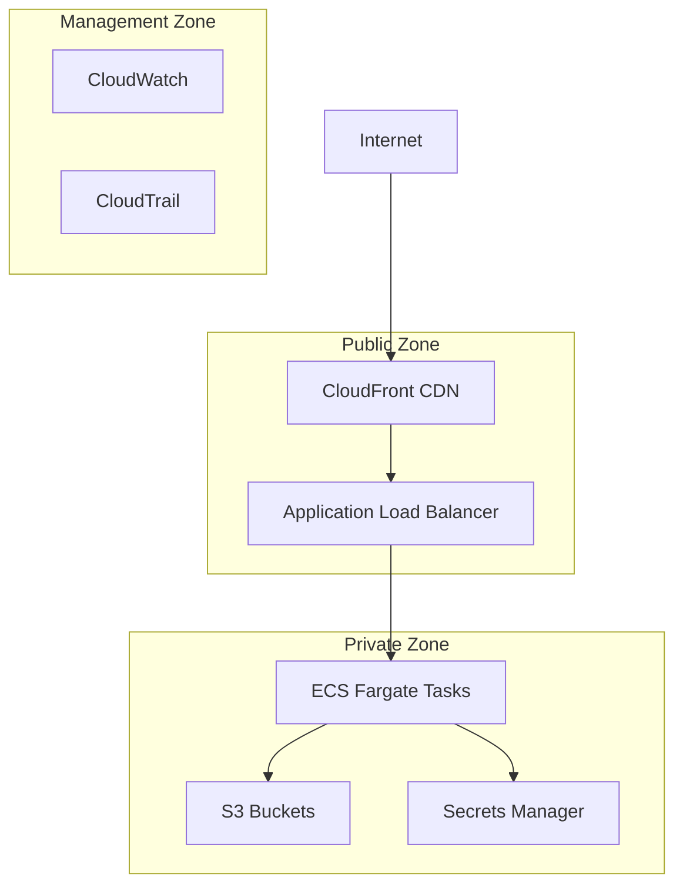

# Security and Compliance Guide

## Overview

This guide provides comprehensive security configurations, compliance requirements, and best practices for the Children's Drawing Anomaly Detection System deployed on AWS.

## Security Architecture

### Defense in Depth Strategy

The security architecture implements multiple layers of protection:

1. **Network Security**: VPC isolation, private subnets, security groups
2. **Identity and Access Management**: IAM roles with least privilege
3. **Data Protection**: Encryption at rest and in transit
4. **Application Security**: Authentication, input validation, secure coding
5. **Monitoring and Logging**: Comprehensive audit trails and alerting
6. **Incident Response**: Automated detection and response procedures

### Security Zones



## Network Security

### VPC Configuration

#### Network Segmentation
- **VPC CIDR**: 10.0.0.0/16 (isolated network)
- **Public Subnets**: 10.0.1.0/24, 10.0.2.0/24 (ALB only)
- **Private Subnets**: 10.0.11.0/24, 10.0.12.0/24 (ECS tasks)
- **Multi-AZ Deployment**: High availability across availability zones

#### Security Groups Configuration

```yaml
# Application Load Balancer Security Group
ALBSecurityGroup:
  Type: AWS::EC2::SecurityGroup
  Properties:
    GroupDescription: Security group for Application Load Balancer
    VpcId: !Ref VPC
    SecurityGroupIngress:
      - IpProtocol: tcp
        FromPort: 80
        ToPort: 80
        CidrIp: 0.0.0.0/0
        Description: HTTP from internet
      - IpProtocol: tcp
        FromPort: 443
        ToPort: 443
        CidrIp: 0.0.0.0/0
        Description: HTTPS from internet
    SecurityGroupEgress:
      - IpProtocol: tcp
        FromPort: 8000
        ToPort: 8000
        DestinationSecurityGroupId: !Ref ECSSecurityGroup
        Description: HTTP to ECS tasks

# ECS Tasks Security Group
ECSSecurityGroup:
  Type: AWS::EC2::SecurityGroup
  Properties:
    GroupDescription: Security group for ECS tasks
    VpcId: !Ref VPC
    SecurityGroupIngress:
      - IpProtocol: tcp
        FromPort: 8000
        ToPort: 8000
        SourceSecurityGroupId: !Ref ALBSecurityGroup
        Description: HTTP from ALB only
    SecurityGroupEgress:
      - IpProtocol: tcp
        FromPort: 443
        ToPort: 443
        CidrIp: 0.0.0.0/0
        Description: HTTPS for AWS API calls
      - IpProtocol: tcp
        FromPort: 80
        ToPort: 80
        CidrIp: 0.0.0.0/0
        Description: HTTP for package downloads
```

#### Network Access Control Lists (NACLs)

```yaml
# Private Subnet NACL
PrivateNetworkAcl:
  Type: AWS::EC2::NetworkAcl
  Properties:
    VpcId: !Ref VPC
    Tags:
      - Key: Name
        Value: !Sub ${AWS::StackName}-private-nacl

# Allow inbound HTTP from public subnets
PrivateNetworkAclEntryInboundHTTP:
  Type: AWS::EC2::NetworkAclEntry
  Properties:
    NetworkAclId: !Ref PrivateNetworkAcl
    RuleNumber: 100
    Protocol: 6
    RuleAction: allow
    CidrBlock: 10.0.0.0/16
    PortRange:
      From: 8000
      To: 8000

# Allow outbound HTTPS
PrivateNetworkAclEntryOutboundHTTPS:
  Type: AWS::EC2::NetworkAclEntry
  Properties:
    NetworkAclId: !Ref PrivateNetworkAcl
    RuleNumber: 100
    Protocol: 6
    Egress: true
    RuleAction: allow
    CidrBlock: 0.0.0.0/0
    PortRange:
      From: 443
      To: 443
```

### VPC Flow Logs

```yaml
VPCFlowLogsRole:
  Type: AWS::IAM::Role
  Properties:
    AssumeRolePolicyDocument:
      Version: '2012-10-17'
      Statement:
        - Effect: Allow
          Principal:
            Service: vpc-flow-logs.amazonaws.com
          Action: sts:AssumeRole
    Policies:
      - PolicyName: CloudWatchLogPolicy
        PolicyDocument:
          Version: '2012-10-17'
          Statement:
            - Effect: Allow
              Action:
                - logs:CreateLogGroup
                - logs:CreateLogStream
                - logs:PutLogEvents
                - logs:DescribeLogGroups
                - logs:DescribeLogStreams
              Resource: '*'

VPCFlowLog:
  Type: AWS::EC2::FlowLog
  Properties:
    ResourceType: VPC
    ResourceId: !Ref VPC
    TrafficType: ALL
    LogDestinationType: cloud-watch-logs
    LogGroupName: !Sub /aws/vpc/flowlogs/${AWS::StackName}
    DeliverLogsPermissionArn: !GetAtt VPCFlowLogsRole.Arn
```

## Identity and Access Management (IAM)

### Principle of Least Privilege

#### ECS Task Execution Role
```json
{
  "Version": "2012-10-17",
  "Statement": [
    {
      "Effect": "Allow",
      "Action": [
        "ecr:GetAuthorizationToken",
        "ecr:BatchCheckLayerAvailability",
        "ecr:GetDownloadUrlForLayer",
        "ecr:BatchGetImage"
      ],
      "Resource": "*"
    },
    {
      "Effect": "Allow",
      "Action": [
        "logs:CreateLogStream",
        "logs:PutLogEvents"
      ],
      "Resource": "arn:aws:logs:eu-west-1:*:log-group:/ecs/children-drawing-prod:*"
    },
    {
      "Effect": "Allow",
      "Action": [
        "secretsmanager:GetSecretValue"
      ],
      "Resource": "arn:aws:secretsmanager:eu-west-1:*:secret:children-drawing-prod-admin-password-*"
    }
  ]
}
```

#### ECS Task Role
```json
{
  "Version": "2012-10-17",
  "Statement": [
    {
      "Effect": "Allow",
      "Action": [
        "s3:GetObject",
        "s3:PutObject",
        "s3:DeleteObject"
      ],
      "Resource": [
        "arn:aws:s3:::children-drawing-production-drawings-*/*",
        "arn:aws:s3:::children-drawing-production-models-*/*",
        "arn:aws:s3:::children-drawing-production-backups-*/*"
      ]
    },
    {
      "Effect": "Allow",
      "Action": [
        "s3:ListBucket"
      ],
      "Resource": [
        "arn:aws:s3:::children-drawing-production-drawings-*",
        "arn:aws:s3:::children-drawing-production-models-*",
        "arn:aws:s3:::children-drawing-production-backups-*"
      ]
    },
    {
      "Effect": "Allow",
      "Action": [
        "cloudwatch:PutMetricData"
      ],
      "Resource": "*",
      "Condition": {
        "StringEquals": {
          "cloudwatch:namespace": "ChildrenDrawing/Application"
        }
      }
    },
    {
      "Effect": "Allow",
      "Action": [
        "secretsmanager:GetSecretValue"
      ],
      "Resource": "arn:aws:secretsmanager:eu-west-1:*:secret:children-drawing-prod-admin-password-*"
    }
  ]
}
```

### IAM Security Best Practices

#### 1. Role-Based Access Control
```bash
# Create deployment role with minimal permissions
aws iam create-role \
  --role-name ChildrenDrawingDeploymentRole \
  --assume-role-policy-document '{
    "Version": "2012-10-17",
    "Statement": [
      {
        "Effect": "Allow",
        "Principal": {
          "AWS": "arn:aws:iam::ACCOUNT-ID:user/deployment-user"
        },
        "Action": "sts:AssumeRole",
        "Condition": {
          "StringEquals": {
            "sts:ExternalId": "unique-external-id"
          }
        }
      }
    ]
  }'
```

#### 2. Cross-Account Access Control
```json
{
  "Version": "2012-10-17",
  "Statement": [
    {
      "Sid": "CrossAccountS3Access",
      "Effect": "Allow",
      "Principal": {
        "AWS": "arn:aws:iam::BACKUP-ACCOUNT-ID:role/BackupRole"
      },
      "Action": [
        "s3:GetObject",
        "s3:ListBucket"
      ],
      "Resource": [
        "arn:aws:s3:::children-drawing-production-backups-*",
        "arn:aws:s3:::children-drawing-production-backups-*/*"
      ],
      "Condition": {
        "StringEquals": {
          "s3:x-amz-server-side-encryption": "AES256"
        }
      }
    }
  ]
}
```

## Data Protection

### Encryption at Rest

#### S3 Bucket Encryption
```yaml
DrawingsBucket:
  Type: AWS::S3::Bucket
  Properties:
    BucketEncryption:
      ServerSideEncryptionConfiguration:
        - ServerSideEncryptionByDefault:
            SSEAlgorithm: AES256
            # Alternative: Use KMS for additional key management
            # SSEAlgorithm: aws:kms
            # KMSMasterKeyID: !Ref S3KMSKey
        - BucketKeyEnabled: true
    PublicAccessBlockConfiguration:
      BlockPublicAcls: true
      BlockPublicPolicy: true
      IgnorePublicAcls: true
      RestrictPublicBuckets: true
```

#### KMS Key Management (Optional)
```yaml
S3KMSKey:
  Type: AWS::KMS::Key
  Properties:
    Description: KMS key for S3 bucket encryption
    KeyPolicy:
      Version: '2012-10-17'
      Statement:
        - Sid: Enable IAM User Permissions
          Effect: Allow
          Principal:
            AWS: !Sub 'arn:aws:iam::${AWS::AccountId}:root'
          Action: 'kms:*'
          Resource: '*'
        - Sid: Allow ECS Task Role
          Effect: Allow
          Principal:
            AWS: !GetAtt ECSTaskRole.Arn
          Action:
            - kms:Decrypt
            - kms:GenerateDataKey
          Resource: '*'

S3KMSKeyAlias:
  Type: AWS::KMS::Alias
  Properties:
    AliasName: alias/children-drawing-s3-key
    TargetKeyId: !Ref S3KMSKey
```

### Encryption in Transit

#### TLS Configuration
```yaml
# CloudFront TLS Configuration
CloudFrontDistribution:
  Type: AWS::CloudFront::Distribution
  Properties:
    DistributionConfig:
      ViewerCertificate:
        AcmCertificateArn: !Ref SSLCertificate
        SslSupportMethod: sni-only
        MinimumProtocolVersion: TLSv1.2_2021
      ViewerProtocolPolicy: redirect-to-https

# Application Load Balancer TLS
ALBListenerHTTPS:
  Type: AWS::ElasticLoadBalancingV2::Listener
  Properties:
    Protocol: HTTPS
    Port: 443
    Certificates:
      - CertificateArn: !Ref SSLCertificate
    SslPolicy: ELBSecurityPolicy-TLS-1-2-2017-01
```

#### Internal Service Communication
```python
# Application configuration for secure internal communication
import ssl
import requests

# Configure secure requests
session = requests.Session()
session.verify = True  # Verify SSL certificates
session.headers.update({
    'User-Agent': 'ChildrenDrawingApp/1.0',
    'X-Content-Type-Options': 'nosniff',
    'X-Frame-Options': 'DENY',
    'X-XSS-Protection': '1; mode=block'
})

# Use TLS 1.2+ for all external API calls
ssl_context = ssl.create_default_context()
ssl_context.minimum_version = ssl.TLSVersion.TLSv1_2
```

## Application Security

### Authentication and Authorization

#### Session-Based Authentication
```python
# app/core/auth_middleware.py
import secrets
import hashlib
from datetime import datetime, timedelta
from fastapi import HTTPException, status
from fastapi.security import HTTPBearer
import boto3

class AuthenticationMiddleware:
    def __init__(self):
        self.secrets_client = boto3.client('secretsmanager')
        self.session_timeout = timedelta(hours=8)
        
    async def verify_admin_password(self, password: str) -> bool:
        """Verify admin password against Secrets Manager"""
        try:
            response = self.secrets_client.get_secret_value(
                SecretId='children-drawing-prod-admin-password'
            )
            stored_password = json.loads(response['SecretString'])['password']
            
            # Use secure password comparison
            return secrets.compare_digest(
                hashlib.sha256(password.encode()).hexdigest(),
                hashlib.sha256(stored_password.encode()).hexdigest()
            )
        except Exception as e:
            logger.error(f"Password verification failed: {e}")
            return False
    
    async def create_session(self, user_id: str) -> str:
        """Create secure session token"""
        session_token = secrets.token_urlsafe(32)
        session_data = {
            'user_id': user_id,
            'created_at': datetime.utcnow().isoformat(),
            'expires_at': (datetime.utcnow() + self.session_timeout).isoformat()
        }
        
        # Store session in secure storage (Redis/DynamoDB)
        await self.store_session(session_token, session_data)
        return session_token
    
    async def validate_session(self, session_token: str) -> dict:
        """Validate session token"""
        session_data = await self.get_session(session_token)
        if not session_data:
            raise HTTPException(
                status_code=status.HTTP_401_UNAUTHORIZED,
                detail="Invalid session"
            )
        
        expires_at = datetime.fromisoformat(session_data['expires_at'])
        if datetime.utcnow() > expires_at:
            await self.delete_session(session_token)
            raise HTTPException(
                status_code=status.HTTP_401_UNAUTHORIZED,
                detail="Session expired"
            )
        
        return session_data
```

#### Route Protection
```python
# app/api/api_v1/endpoints/auth.py
from fastapi import APIRouter, Depends, HTTPException, status
from fastapi.security import HTTPBearer
from app.core.auth_middleware import AuthenticationMiddleware

router = APIRouter()
security = HTTPBearer()
auth_middleware = AuthenticationMiddleware()

async def get_current_user(token: str = Depends(security)):
    """Dependency to get current authenticated user"""
    return await auth_middleware.validate_session(token.credentials)

@router.post("/login")
async def login(credentials: LoginCredentials):
    """Admin login endpoint"""
    if await auth_middleware.verify_admin_password(credentials.password):
        session_token = await auth_middleware.create_session("admin")
        return {"access_token": session_token, "token_type": "bearer"}
    else:
        raise HTTPException(
            status_code=status.HTTP_401_UNAUTHORIZED,
            detail="Invalid credentials"
        )

@router.get("/protected-endpoint")
async def protected_endpoint(current_user: dict = Depends(get_current_user)):
    """Example protected endpoint"""
    return {"message": "Access granted", "user": current_user}
```

### Input Validation and Sanitization

#### File Upload Security
```python
# app/services/file_validation.py
import magic
import hashlib
from PIL import Image
from fastapi import HTTPException, status

class FileValidator:
    ALLOWED_MIME_TYPES = {
        'image/jpeg',
        'image/png',
        'image/bmp'
    }
    MAX_FILE_SIZE = 10 * 1024 * 1024  # 10MB
    MAX_IMAGE_DIMENSIONS = (4096, 4096)
    
    @staticmethod
    def validate_file_upload(file_content: bytes, filename: str) -> dict:
        """Comprehensive file validation"""
        
        # 1. File size validation
        if len(file_content) > FileValidator.MAX_FILE_SIZE:
            raise HTTPException(
                status_code=status.HTTP_413_REQUEST_ENTITY_TOO_LARGE,
                detail="File size exceeds maximum allowed size"
            )
        
        # 2. MIME type validation using python-magic
        mime_type = magic.from_buffer(file_content, mime=True)
        if mime_type not in FileValidator.ALLOWED_MIME_TYPES:
            raise HTTPException(
                status_code=status.HTTP_400_BAD_REQUEST,
                detail=f"File type {mime_type} not allowed"
            )
        
        # 3. File extension validation
        allowed_extensions = {'.jpg', '.jpeg', '.png', '.bmp'}
        file_extension = Path(filename).suffix.lower()
        if file_extension not in allowed_extensions:
            raise HTTPException(
                status_code=status.HTTP_400_BAD_REQUEST,
                detail=f"File extension {file_extension} not allowed"
            )
        
        # 4. Image validation using PIL
        try:
            image = Image.open(io.BytesIO(file_content))
            image.verify()  # Verify image integrity
            
            # Check image dimensions
            if image.size[0] > FileValidator.MAX_IMAGE_DIMENSIONS[0] or \
               image.size[1] > FileValidator.MAX_IMAGE_DIMENSIONS[1]:
                raise HTTPException(
                    status_code=status.HTTP_400_BAD_REQUEST,
                    detail="Image dimensions exceed maximum allowed size"
                )
        except Exception as e:
            raise HTTPException(
                status_code=status.HTTP_400_BAD_REQUEST,
                detail="Invalid image file"
            )
        
        # 5. Generate file hash for integrity
        file_hash = hashlib.sha256(file_content).hexdigest()
        
        return {
            'mime_type': mime_type,
            'file_size': len(file_content),
            'file_hash': file_hash,
            'image_dimensions': image.size
        }
```

#### API Input Validation
```python
# app/schemas/validation.py
from pydantic import BaseModel, validator, Field
from typing import Optional
import re

class DrawingUploadRequest(BaseModel):
    age_group: str = Field(..., regex=r'^(2-3|3-4|4-5|5-6|6-7|7-8|8-9|9-12)$')
    description: Optional[str] = Field(None, max_length=500)
    
    @validator('description')
    def validate_description(cls, v):
        if v is not None:
            # Remove potentially dangerous characters
            sanitized = re.sub(r'[<>"\']', '', v)
            return sanitized.strip()
        return v

class ConfigurationUpdate(BaseModel):
    threshold_percentile: float = Field(..., ge=50.0, le=99.9)
    enable_interpretability: bool = True
    
    @validator('threshold_percentile')
    def validate_threshold(cls, v):
        # Ensure reasonable threshold values
        if not 50.0 <= v <= 99.9:
            raise ValueError('Threshold percentile must be between 50.0 and 99.9')
        return round(v, 1)
```

### Security Headers and CORS

#### Security Headers Middleware
```python
# app/core/security_middleware.py
from fastapi import Request, Response
from fastapi.middleware.base import BaseHTTPMiddleware

class SecurityHeadersMiddleware(BaseHTTPMiddleware):
    async def dispatch(self, request: Request, call_next):
        response = await call_next(request)
        
        # Security headers
        response.headers["X-Content-Type-Options"] = "nosniff"
        response.headers["X-Frame-Options"] = "DENY"
        response.headers["X-XSS-Protection"] = "1; mode=block"
        response.headers["Referrer-Policy"] = "strict-origin-when-cross-origin"
        response.headers["Permissions-Policy"] = "geolocation=(), microphone=(), camera=()"
        
        # Content Security Policy
        csp = (
            "default-src 'self'; "
            "script-src 'self' 'unsafe-inline' https://cdn.jsdelivr.net; "
            "style-src 'self' 'unsafe-inline' https://fonts.googleapis.com; "
            "font-src 'self' https://fonts.gstatic.com; "
            "img-src 'self' data: https:; "
            "connect-src 'self' https://api.github.com"
        )
        response.headers["Content-Security-Policy"] = csp
        
        # HSTS (if using HTTPS)
        if request.url.scheme == "https":
            response.headers["Strict-Transport-Security"] = "max-age=31536000; includeSubDomains"
        
        return response
```

#### CORS Configuration
```python
# app/main.py
from fastapi.middleware.cors import CORSMiddleware

app.add_middleware(
    CORSMiddleware,
    allow_origins=[
        "https://your-domain.com",
        "https://www.your-domain.com"
    ],
    allow_credentials=True,
    allow_methods=["GET", "POST", "PUT", "DELETE"],
    allow_headers=["*"],
    expose_headers=["X-Total-Count"]
)
```

## Monitoring and Logging

### Security Event Monitoring

#### CloudTrail Configuration
```yaml
CloudTrail:
  Type: AWS::CloudTrail::Trail
  Properties:
    TrailName: !Sub ${AWS::StackName}-cloudtrail
    S3BucketName: !Ref CloudTrailBucket
    S3KeyPrefix: cloudtrail-logs/
    IncludeGlobalServiceEvents: true
    IsMultiRegionTrail: true
    EnableLogFileValidation: true
    EventSelectors:
      - ReadWriteType: All
        IncludeManagementEvents: true
        DataResources:
          - Type: AWS::S3::Object
            Values:
              - !Sub ${DrawingsBucket}/*
              - !Sub ${ModelsBucket}/*
              - !Sub ${BackupsBucket}/*
          - Type: AWS::S3::Bucket
            Values:
              - !Ref DrawingsBucket
              - !Ref ModelsBucket
              - !Ref BackupsBucket

CloudTrailBucket:
  Type: AWS::S3::Bucket
  Properties:
    BucketName: !Sub ${AWS::StackName}-cloudtrail-${AWS::AccountId}
    BucketEncryption:
      ServerSideEncryptionConfiguration:
        - ServerSideEncryptionByDefault:
            SSEAlgorithm: AES256
    PublicAccessBlockConfiguration:
      BlockPublicAcls: true
      BlockPublicPolicy: true
      IgnorePublicAcls: true
      RestrictPublicBuckets: true
```

#### Security Alarms
```yaml
# Failed login attempts alarm
FailedLoginAlarm:
  Type: AWS::CloudWatch::Alarm
  Properties:
    AlarmName: !Sub ${AWS::StackName}-failed-logins
    AlarmDescription: Multiple failed login attempts detected
    MetricName: FailedLoginAttempts
    Namespace: ChildrenDrawing/Security
    Statistic: Sum
    Period: 300
    EvaluationPeriods: 1
    Threshold: 5
    ComparisonOperator: GreaterThanOrEqualToThreshold
    AlarmActions:
      - !Ref SecurityAlertTopic

# Unusual API access patterns
UnusualAPIAccessAlarm:
  Type: AWS::CloudWatch::Alarm
  Properties:
    AlarmName: !Sub ${AWS::StackName}-unusual-api-access
    AlarmDescription: Unusual API access patterns detected
    MetricName: APIRequestCount
    Namespace: AWS/ApplicationELB
    Statistic: Sum
    Period: 300
    EvaluationPeriods: 2
    Threshold: 1000
    ComparisonOperator: GreaterThanThreshold
    Dimensions:
      - Name: LoadBalancer
        Value: !GetAtt ApplicationLoadBalancer.LoadBalancerFullName
```

### Application Security Logging
```python
# app/core/security_logger.py
import logging
import json
from datetime import datetime
from fastapi import Request

class SecurityLogger:
    def __init__(self):
        self.logger = logging.getLogger("security")
        self.logger.setLevel(logging.INFO)
        
        # CloudWatch handler
        handler = logging.StreamHandler()
        formatter = logging.Formatter(
            '%(asctime)s - %(name)s - %(levelname)s - %(message)s'
        )
        handler.setFormatter(formatter)
        self.logger.addHandler(handler)
    
    def log_authentication_attempt(self, request: Request, success: bool, user_id: str = None):
        """Log authentication attempts"""
        event = {
            'event_type': 'authentication_attempt',
            'timestamp': datetime.utcnow().isoformat(),
            'success': success,
            'user_id': user_id,
            'ip_address': request.client.host,
            'user_agent': request.headers.get('user-agent'),
            'request_id': request.headers.get('x-request-id')
        }
        
        if success:
            self.logger.info(f"Authentication successful: {json.dumps(event)}")
        else:
            self.logger.warning(f"Authentication failed: {json.dumps(event)}")
    
    def log_file_upload(self, request: Request, file_info: dict, user_id: str):
        """Log file upload events"""
        event = {
            'event_type': 'file_upload',
            'timestamp': datetime.utcnow().isoformat(),
            'user_id': user_id,
            'file_hash': file_info.get('file_hash'),
            'file_size': file_info.get('file_size'),
            'mime_type': file_info.get('mime_type'),
            'ip_address': request.client.host,
            'request_id': request.headers.get('x-request-id')
        }
        
        self.logger.info(f"File upload: {json.dumps(event)}")
    
    def log_security_violation(self, request: Request, violation_type: str, details: dict):
        """Log security violations"""
        event = {
            'event_type': 'security_violation',
            'violation_type': violation_type,
            'timestamp': datetime.utcnow().isoformat(),
            'ip_address': request.client.host,
            'user_agent': request.headers.get('user-agent'),
            'details': details,
            'request_id': request.headers.get('x-request-id')
        }
        
        self.logger.error(f"Security violation: {json.dumps(event)}")
```

## Incident Response

### Automated Security Response

#### Lambda Function for Security Incidents
```python
import json
import boto3
from datetime import datetime

def lambda_handler(event, context):
    """
    Automated security incident response
    """
    
    # Parse CloudWatch alarm
    message = json.loads(event['Records'][0]['Sns']['Message'])
    alarm_name = message['AlarmName']
    
    if 'failed-logins' in alarm_name:
        handle_failed_login_incident(message)
    elif 'unusual-api-access' in alarm_name:
        handle_unusual_access_incident(message)
    
    return {
        'statusCode': 200,
        'body': json.dumps('Security incident handled')
    }

def handle_failed_login_incident(alarm_data):
    """Handle multiple failed login attempts"""
    
    # 1. Get source IP from logs
    logs_client = boto3.client('logs')
    
    # Query CloudWatch logs for failed login attempts
    query = """
    fields @timestamp, ip_address, user_agent
    | filter event_type = "authentication_attempt"
    | filter success = false
    | stats count() by ip_address
    | sort count desc
    | limit 10
    """
    
    # 2. Temporarily block suspicious IPs (implement IP blocking logic)
    # 3. Send detailed alert to security team
    send_security_alert("Multiple Failed Login Attempts", alarm_data)

def handle_unusual_access_incident(alarm_data):
    """Handle unusual API access patterns"""
    
    # 1. Analyze access patterns
    # 2. Check for known attack signatures
    # 3. Implement rate limiting if needed
    # 4. Alert security team
    send_security_alert("Unusual API Access Pattern", alarm_data)

def send_security_alert(incident_type, details):
    """Send security alert to operations team"""
    sns_client = boto3.client('sns')
    
    message = f"""
    🚨 SECURITY INCIDENT DETECTED 🚨
    
    Incident Type: {incident_type}
    Timestamp: {datetime.utcnow().isoformat()}
    
    Details: {json.dumps(details, indent=2)}
    
    Automated Response: Initial containment measures activated
    Manual Review Required: Yes
    """
    
    sns_client.publish(
        TopicArn='arn:aws:sns:eu-west-1:ACCOUNT:security-alerts',
        Message=message,
        Subject=f'Security Incident: {incident_type}'
    )
```

### Manual Incident Response Procedures

#### Security Incident Playbook

**Phase 1: Detection and Analysis (0-15 minutes)**
1. Verify the security alert is legitimate
2. Determine the scope and impact of the incident
3. Classify the incident severity (P0-P3)
4. Activate incident response team

**Phase 2: Containment (15-60 minutes)**
1. Isolate affected systems
2. Preserve evidence for forensic analysis
3. Implement temporary security controls
4. Document all actions taken

**Phase 3: Eradication and Recovery (1-24 hours)**
1. Remove the threat from the environment
2. Apply security patches and updates
3. Restore systems from clean backups if needed
4. Implement additional security controls

**Phase 4: Post-Incident Activities (24-72 hours)**
1. Conduct lessons learned session
2. Update security procedures and documentation
3. Implement preventive measures
4. File incident report

#### Emergency Response Commands

```bash
#!/bin/bash
# emergency-security-response.sh

echo "🚨 EMERGENCY SECURITY RESPONSE 🚨"

# 1. Isolate ECS service
echo "Isolating ECS service..."
aws ecs update-service \
  --cluster children-drawing-prod-cluster \
  --service children-drawing-prod-service \
  --desired-count 0 \
  --region eu-west-1

# 2. Block suspicious traffic at ALB level
echo "Implementing emergency access controls..."
aws elbv2 modify-listener \
  --listener-arn $(aws elbv2 describe-listeners --load-balancer-arn $(aws elbv2 describe-load-balancers --names children-drawing-prod-alb --query 'LoadBalancers[0].LoadBalancerArn' --output text --region eu-west-1) --query 'Listeners[0].ListenerArn' --output text --region eu-west-1) \
  --default-actions Type=fixed-response,FixedResponseConfig='{StatusCode=503,ContentType=text/plain,MessageBody=Service temporarily unavailable}' \
  --region eu-west-1

# 3. Rotate all secrets
echo "Rotating secrets..."
aws secretsmanager rotate-secret \
  --secret-id children-drawing-prod-admin-password \
  --region eu-west-1

# 4. Enable detailed logging
echo "Enabling detailed logging..."
aws logs put-retention-policy \
  --log-group-name /ecs/children-drawing-prod \
  --retention-in-days 90 \
  --region eu-west-1

# 5. Create security snapshot
echo "Creating security snapshot..."
aws s3 sync s3://children-drawing-production-drawings-$(aws sts get-caller-identity --query Account --output text) s3://security-incident-backup-$(date +%Y%m%d)/drawings/

# 6. Send notification
aws sns publish \
  --topic-arn arn:aws:sns:eu-west-1:$(aws sts get-caller-identity --query Account --output text):security-alerts \
  --message "Emergency security response activated. All services isolated. Manual review required." \
  --subject "EMERGENCY: Security Response Activated" \
  --region eu-west-1

echo "Emergency response completed. Manual review required."
```

## Compliance and Governance

### Compliance Framework

#### Data Protection Compliance
- **Data Classification**: Sensitive (children's drawings), Internal (system logs), Public (documentation)
- **Data Retention**: 90 days for drawings, 30 days for logs, 365 days for backups
- **Data Anonymization**: Remove PII from logs and analytics
- **Right to Deletion**: Implement data deletion procedures

#### Security Compliance Checklist

**Infrastructure Security**
- [ ] VPC with private subnets implemented
- [ ] Security groups with minimal access configured
- [ ] Network ACLs for additional layer of security
- [ ] VPC Flow Logs enabled for network monitoring
- [ ] NAT Gateway or VPC Endpoints for secure outbound access

**Identity and Access Management**
- [ ] IAM roles with least privilege principle
- [ ] No hardcoded credentials in code or configuration
- [ ] Regular access reviews and cleanup
- [ ] Multi-factor authentication for administrative access
- [ ] Service-linked roles where applicable

**Data Protection**
- [ ] Encryption at rest for all data stores
- [ ] Encryption in transit for all communications
- [ ] Key management through AWS KMS
- [ ] Regular backup and recovery testing
- [ ] Data classification and handling procedures

**Monitoring and Logging**
- [ ] CloudTrail enabled for all regions
- [ ] CloudWatch monitoring for all services
- [ ] Security event alerting configured
- [ ] Log retention policies implemented
- [ ] Incident response procedures documented

**Application Security**
- [ ] Input validation and sanitization
- [ ] Authentication and authorization controls
- [ ] Security headers implemented
- [ ] Regular security testing and code reviews
- [ ] Dependency vulnerability scanning

### Audit and Assessment

#### Security Assessment Checklist

```bash
#!/bin/bash
# security-assessment.sh

echo "=== Security Assessment Report ==="
echo "Generated: $(date)"
echo ""

# 1. Check IAM roles and policies
echo "1. IAM Security Assessment"
aws iam list-roles --query 'Roles[?contains(RoleName, `children-drawing`)].[RoleName,CreateDate]' --output table --region eu-west-1

# 2. Check S3 bucket security
echo "2. S3 Bucket Security"
for bucket in $(aws s3 ls | grep children-drawing | awk '{print $3}'); do
  echo "Bucket: $bucket"
  aws s3api get-bucket-encryption --bucket $bucket 2>/dev/null || echo "  ❌ Encryption not enabled"
  aws s3api get-public-access-block --bucket $bucket --query 'PublicAccessBlockConfiguration' --output table 2>/dev/null || echo "  ❌ Public access block not configured"
done

# 3. Check security groups
echo "3. Security Groups Assessment"
aws ec2 describe-security-groups \
  --filters Name=group-name,Values=*children-drawing* \
  --query 'SecurityGroups[*].[GroupName,GroupId,IpPermissions[?IpProtocol==`-1` || (FromPort==`0` && ToPort==`65535`)]]' \
  --output table \
  --region eu-west-1

# 4. Check CloudTrail status
echo "4. CloudTrail Status"
aws cloudtrail describe-trails \
  --query 'trailList[?contains(Name, `children-drawing`)].[Name,IsMultiRegionTrail,LogFileValidationEnabled]' \
  --output table \
  --region eu-west-1

# 5. Check ECS task security
echo "5. ECS Task Security"
aws ecs describe-task-definition \
  --task-definition children-drawing-prod-task \
  --query 'taskDefinition.[family,taskRoleArn,executionRoleArn,networkMode]' \
  --output table \
  --region eu-west-1

echo "=== Assessment Complete ==="
```

#### Compliance Reporting

```python
# scripts/compliance_report.py
import boto3
import json
from datetime import datetime, timedelta

class ComplianceReporter:
    def __init__(self):
        self.cloudtrail = boto3.client('cloudtrail')
        self.s3 = boto3.client('s3')
        self.iam = boto3.client('iam')
        
    def generate_compliance_report(self):
        """Generate comprehensive compliance report"""
        
        report = {
            'report_date': datetime.utcnow().isoformat(),
            'compliance_status': 'COMPLIANT',
            'findings': [],
            'recommendations': []
        }
        
        # Check encryption compliance
        encryption_status = self.check_encryption_compliance()
        report['encryption_compliance'] = encryption_status
        
        # Check access control compliance
        access_control_status = self.check_access_control_compliance()
        report['access_control_compliance'] = access_control_status
        
        # Check logging compliance
        logging_status = self.check_logging_compliance()
        report['logging_compliance'] = logging_status
        
        # Generate recommendations
        report['recommendations'] = self.generate_recommendations(report)
        
        return report
    
    def check_encryption_compliance(self):
        """Check encryption compliance for all data stores"""
        findings = []
        
        # Check S3 bucket encryption
        buckets = self.s3.list_buckets()['Buckets']
        for bucket in buckets:
            if 'children-drawing' in bucket['Name']:
                try:
                    encryption = self.s3.get_bucket_encryption(Bucket=bucket['Name'])
                    findings.append({
                        'resource': bucket['Name'],
                        'status': 'COMPLIANT',
                        'details': 'Encryption enabled'
                    })
                except:
                    findings.append({
                        'resource': bucket['Name'],
                        'status': 'NON_COMPLIANT',
                        'details': 'Encryption not enabled'
                    })
        
        return findings
    
    def check_access_control_compliance(self):
        """Check IAM access control compliance"""
        findings = []
        
        # Check for overly permissive policies
        roles = self.iam.list_roles()['Roles']
        for role in roles:
            if 'children-drawing' in role['RoleName']:
                policies = self.iam.list_attached_role_policies(RoleName=role['RoleName'])
                findings.append({
                    'resource': role['RoleName'],
                    'status': 'COMPLIANT',
                    'details': f"Policies attached: {len(policies['AttachedPolicies'])}"
                })
        
        return findings
    
    def check_logging_compliance(self):
        """Check logging and monitoring compliance"""
        findings = []
        
        # Check CloudTrail status
        trails = self.cloudtrail.describe_trails()['trailList']
        for trail in trails:
            if 'children-drawing' in trail['Name']:
                findings.append({
                    'resource': trail['Name'],
                    'status': 'COMPLIANT' if trail['IsMultiRegionTrail'] else 'PARTIAL',
                    'details': f"Multi-region: {trail['IsMultiRegionTrail']}"
                })
        
        return findings
    
    def generate_recommendations(self, report):
        """Generate security recommendations based on findings"""
        recommendations = []
        
        # Analyze findings and generate recommendations
        for section in ['encryption_compliance', 'access_control_compliance', 'logging_compliance']:
            for finding in report.get(section, []):
                if finding['status'] == 'NON_COMPLIANT':
                    recommendations.append({
                        'priority': 'HIGH',
                        'resource': finding['resource'],
                        'recommendation': f"Address compliance issue: {finding['details']}"
                    })
        
        return recommendations

if __name__ == "__main__":
    reporter = ComplianceReporter()
    report = reporter.generate_compliance_report()
    
    with open(f"compliance_report_{datetime.now().strftime('%Y%m%d')}.json", 'w') as f:
        json.dump(report, f, indent=2)
    
    print("Compliance report generated successfully")
```

This comprehensive security and compliance guide provides the foundation for maintaining a secure AWS deployment of the Children's Drawing Anomaly Detection System, ensuring data protection, access control, and regulatory compliance.