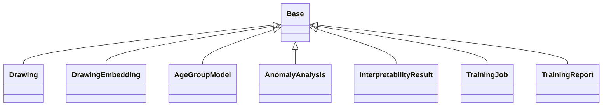

# Models Class Diagram

## Overview
Class diagram showing the structure and relationships of models classes.

## Classes Overview

### Drawing
**Source**: `app/models/database.py`

**Inherits from**: Base

### DrawingEmbedding
**Source**: `app/models/database.py`

**Inherits from**: Base

### AgeGroupModel
**Source**: `app/models/database.py`

**Inherits from**: Base

### AnomalyAnalysis
**Source**: `app/models/database.py`

**Inherits from**: Base

### InterpretabilityResult
**Source**: `app/models/database.py`

**Inherits from**: Base

### TrainingJob
**Source**: `app/models/database.py`

**Inherits from**: Base

### TrainingReport
**Source**: `app/models/database.py`

**Inherits from**: Base

## Class Diagram

## Relationships

| From | To | Type | Description |
|------|----|----- |-------------|
| Drawing | Base | inheritance | Drawing inherits from Base |
| DrawingEmbedding | Base | inheritance | DrawingEmbedding inherits from Base |
| AgeGroupModel | Base | inheritance | AgeGroupModel inherits from Base |
| AnomalyAnalysis | Base | inheritance | AnomalyAnalysis inherits from Base |
| InterpretabilityResult | Base | inheritance | InterpretabilityResult inherits from Base |
| TrainingJob | Base | inheritance | TrainingJob inherits from Base |
| TrainingReport | Base | inheritance | TrainingReport inherits from Base |

