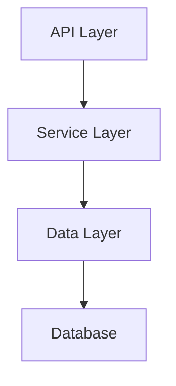

# System Component Diagram

## Overview
Component diagram showing the high-level system architecture and component relationships.

## Components

### API Layer
**Type**: Component
**Description**: REST API endpoints and request handling

**Provides Interfaces**:
- HTTP REST API

**Dependencies**:
- Service Layer

### Service Layer
**Type**: Component
**Description**: Business logic and service implementations

**Provides Interfaces**:
- Service Interfaces

**Dependencies**:
- Data Layer

### Data Layer
**Type**: Component
**Description**: Data models and database access

**Provides Interfaces**:
- Data Access Interface

**Dependencies**:
- Database

## Component Diagram

## Component Relationships

| From | To | Type | Description |
|------|----|----- |-------------|
| API Layer | Service Layer | depends_on | Component dependency |
| Service Layer | Data Layer | depends_on | Component dependency |
| Data Layer | Database | depends_on | Component dependency |

