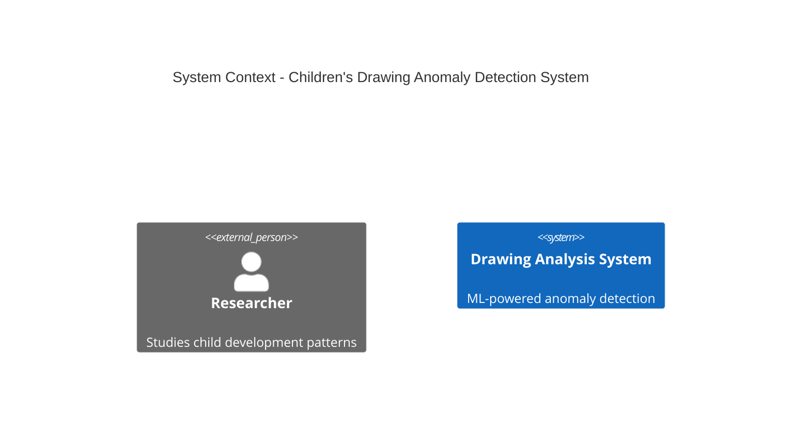
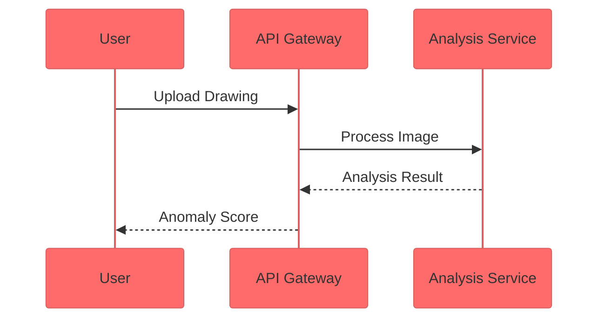

# Documentation Templates Usage Guide

This guide explains how to use the comprehensive documentation templates and styling system for the Children's Drawing Anomaly Detection System.

## Overview

The template system provides:
- **Markdown Templates**: Structured templates for all documentation types
- **Diagram Templates**: Unified Mermaid styling and templates
- **LaTeX Templates**: Mathematical notation and performance analysis
- **CSS Framework**: Responsive styling with dark/light theme support
- **HTML Template**: Complete responsive documentation layout

## Template Categories

### 1. Markdown Templates

Located in `docs/templates/markdown/`:

#### Architecture Documentation (`architecture-c4-template.md`)
- C4 Model compliant templates
- Supports all 4 levels (Context, Container, Component, Code)
- Includes validation sections and architecture decisions

**Usage:**
```markdown
# System Context Diagram (C4 Level 1)

## Overview
ML-powered system for analyzing children's drawings

## System Context Diagram


#### API Documentation (`api-documentation-template.md`)
- OpenAPI 3.0 compliant structure
- Interactive examples and error handling
- Authentication and rate limiting sections

**Usage:**
```markdown
# Drawing Analysis API Documentation

## Overview
REST API for uploading and analyzing children's drawings

**Base URL**: `https://api.example.com/v1`
**Version**: 1.0.0

## Endpoints

### POST /drawings/analyze
Analyzes an uploaded drawing for anomalies
```

#### Algorithm Specification (`algorithm-specification-template.md`)
- IEEE standard compliant mathematical formulations
- Complexity analysis and performance benchmarks
- Property-based testing specifications

**Usage:**
```markdown
# Percentile-Based Score Normalization Algorithm

## Mathematical Formulation
Given a set of historical scores S = {s₁, s₂, ..., sₙ}:

```latex
P(s_{\text{new}}) = \frac{|\{s_i \in S : s_i \leq s_{\text{new}}\}|}{|S|} \times 100
```
```

#### Workflow Documentation (`workflow-bpmn-template.md`)
- BPMN 2.0 compliant process documentation
- User journeys and technical processes
- Error handling and recovery procedures

#### Interface Documentation (`interface-uml-template.md`)
- UML 2.5 compliant interface specifications
- Service contracts and interaction patterns
- Quality of service requirements

### 2. Diagram Templates

Located in `docs/templates/diagrams/`:

#### Unified Mermaid Styling (`mermaid-styles.md`)
All diagrams use consistent theming:

```javascript
%%{init: {
  'theme':'base', 
  'themeVariables': {
    'primaryColor':'#ff6b6b',
    'primaryTextColor':'#fff',
    'primaryBorderColor':'#ff4757',
    'lineColor':'#5f27cd',
    'secondaryColor':'#00d2d3',
    'tertiaryColor':'#ff9ff3'
  }
}}%%
```

**Available Templates:**
- C4 Architecture diagrams (Context, Container, Component)
- Sequence diagrams for interactions
- Class diagrams for data models
- Flowcharts for processes
- State diagrams for workflows
- Entity relationship diagrams

### 3. LaTeX Templates

Located in `docs/templates/latex/`:

#### Mathematical Notation (`mathematical-notation-template.tex`)
- Algorithm definitions and formulations
- Complexity analysis notation
- Statistical properties and proofs

**Usage:**
```latex
% Algorithm definition
\begin{equation}
f^* = \arg\min_{f \in \mathcal{F}} \sum_{i=1}^{n} \loss{f(x_i), y_i} + \lambda \Omega(f)
\end{equation}
```

#### Performance Analysis (`performance-analysis-template.tex`)
- Computational complexity analysis
- Benchmarking methodologies
- Statistical validation techniques

### 4. Responsive Styling System

Located in `docs/templates/styles/`:

#### Main Framework (`documentation-framework.css`)
- CSS custom properties for theming
- Responsive grid system
- Dark/light theme support
- Accessibility compliance (WCAG 2.1 AA)

**Key Features:**
- Mobile-first responsive design
- Consistent typography scale
- Unified color palette
- Smooth transitions and animations

#### Navigation Components (`navigation-components.css`)
- Header and sidebar navigation
- Breadcrumbs and page navigation
- Mobile navigation with overlay
- Feedback and footer components

#### JavaScript Framework (`documentation-framework.js`)
- Theme switching functionality
- Mobile navigation handling
- Search functionality
- Table of contents generation
- Accessibility enhancements

### 5. HTML Template

Complete responsive documentation layout (`html-template.html`):

**Features:**
- Semantic HTML5 structure
- SEO optimization with meta tags
- Accessibility features (skip links, ARIA labels)
- Progressive enhancement
- Service worker support for offline access

## Usage Instructions

### 1. Setting Up Templates

1. **Copy template files** to your documentation directory
2. **Include CSS framework** in your HTML:
   ```html
   <link rel="stylesheet" href="styles/documentation-framework.css">
   <link rel="stylesheet" href="styles/navigation-components.css">
   ```
3. **Include JavaScript framework**:
   ```html
   <script src="styles/documentation-framework.js"></script>
   ```

### 2. Using Markdown Templates

1. **Choose appropriate template** based on documentation type
2. **Replace placeholder variables** (marked with `{{VARIABLE_NAME}}`)
3. **Customize sections** as needed for your content
4. **Validate against requirements** using the built-in validation sections

**Example Variable Replacement:**
```markdown
# {{ALGORITHM_NAME}} Algorithm
# Percentile-Based Score Normalization Algorithm

{{ALGORITHM_DESCRIPTION}}
The score normalization algorithm transforms raw reconstruction loss values...
```

### 3. Creating Diagrams

1. **Use unified theme configuration** for all Mermaid diagrams
2. **Choose appropriate diagram type** from templates
3. **Customize content** while maintaining consistent styling

**Example:**


### 4. Mathematical Notation

1. **Use LaTeX templates** for complex mathematical expressions
2. **Include MathJax** for web rendering:
   ```html
   <script src="https://cdn.jsdelivr.net/npm/mathjax@3/es5/tex-mml-chtml.js"></script>
   ```
3. **Follow IEEE standards** for algorithm documentation

### 5. Responsive Design

The framework automatically handles:
- **Mobile navigation** with hamburger menu
- **Responsive typography** scaling
- **Touch-friendly interactions**
- **Accessibility features**

**Breakpoints:**
- Mobile: ≤ 768px
- Tablet: 769px - 1024px
- Desktop: > 1024px

## Customization

### Theme Customization

Modify CSS custom properties in `:root`:

```css
:root {
  --primary-color: #your-color;
  --font-family-sans: 'Your Font', sans-serif;
  --spacing-md: 1rem;
}
```

### Template Customization

1. **Modify template structure** as needed
2. **Add custom sections** following existing patterns
3. **Update variable placeholders** for your use case
4. **Maintain accessibility standards**

### JavaScript Customization

Extend the `DocumentationFramework` class:

```javascript
class CustomDocumentationFramework extends DocumentationFramework {
  constructor() {
    super();
    this.setupCustomFeatures();
  }
  
  setupCustomFeatures() {
    // Add your custom functionality
  }
}
```

## Validation and Quality Assurance

### Accessibility Testing
- Use axe-core for automated testing
- Test with screen readers
- Verify keyboard navigation
- Check color contrast ratios

### Performance Testing
- Lighthouse audits for performance
- Test on various devices and connections
- Optimize images and assets
- Monitor Core Web Vitals

### Cross-browser Testing
- Test on major browsers (Chrome, Firefox, Safari, Edge)
- Verify responsive behavior
- Test JavaScript functionality
- Validate CSS compatibility

## Best Practices

### Content Creation
1. **Use semantic HTML** structure
2. **Write descriptive alt text** for images
3. **Provide clear headings** hierarchy
4. **Include skip links** for accessibility

### Performance
1. **Optimize images** for web delivery
2. **Minimize CSS and JavaScript**
3. **Use lazy loading** for images
4. **Implement caching strategies**

### Maintenance
1. **Keep templates updated** with latest standards
2. **Regular accessibility audits**
3. **Monitor performance metrics**
4. **Update dependencies** regularly

## Troubleshooting

### Common Issues

#### Theme Not Switching
- Check JavaScript console for errors
- Verify theme toggle button exists
- Ensure CSS custom properties are supported

#### Mobile Navigation Not Working
- Verify JavaScript is loaded
- Check for CSS conflicts
- Test touch events on mobile devices

#### Diagrams Not Rendering
- Ensure Mermaid is loaded
- Check diagram syntax
- Verify theme configuration

#### Mathematical Notation Issues
- Confirm MathJax is loaded
- Check LaTeX syntax
- Verify delimiters are correct

### Browser Support

**Minimum Requirements:**
- Chrome 60+
- Firefox 55+
- Safari 12+
- Edge 79+

**Progressive Enhancement:**
- Basic functionality works without JavaScript
- CSS Grid with flexbox fallback
- Modern features degrade gracefully

## Contributing

To contribute to the template system:

1. **Follow existing patterns** and conventions
2. **Test across browsers** and devices
3. **Validate accessibility** compliance
4. **Update documentation** as needed
5. **Submit pull requests** with clear descriptions

## Support

For questions or issues:
- Check this documentation first
- Review browser console for errors
- Test with minimal configuration
- Report bugs with reproduction steps

---

**Last Updated:** {{CURRENT_DATE}}  
**Version:** 1.0.0  
**Compatibility:** Modern browsers with CSS Grid support