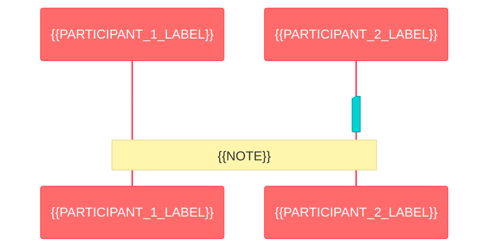
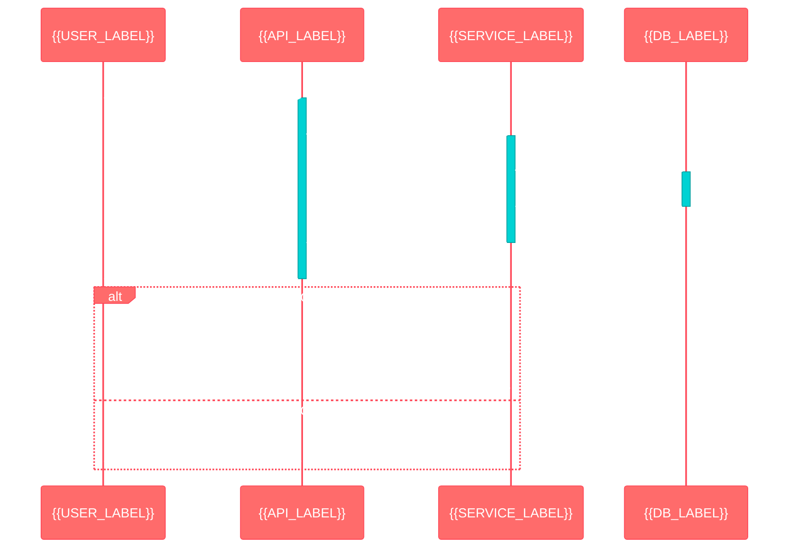

# Mermaid Diagram Styling Templates

## Unified Theme Configuration

All Mermaid diagrams use the following unified theme configuration for consistency:

```javascript
%%{init: {
  'theme':'base', 
  'themeVariables': {
    'primaryColor':'#ff6b6b',
    'primaryTextColor':'#fff',
    'primaryBorderColor':'#ff4757',
    'lineColor':'#5f27cd',
    'secondaryColor':'#00d2d3',
    'tertiaryColor':'#ff9ff3',
    'background':'#ffffff',
    'mainBkg':'#ffffff',
    'secondBkg':'#f8f9fa',
    'tertiaryBkg':'#e9ecef'
  }
}}%%
```

## C4 Architecture Diagrams

### System Context Template

```mermaid
%%{init: {'theme':'base', 'themeVariables': {'primaryColor':'#ff6b6b', 'primaryTextColor':'#fff', 'primaryBorderColor':'#ff4757', 'lineColor':'#5f27cd', 'secondaryColor':'#00d2d3', 'tertiaryColor':'#ff9ff3'}}}%%
C4Context
    title {{TITLE}}
    
    Person_Ext({{PERSON_ID}}, "{{PERSON_NAME}}", "{{PERSON_DESCRIPTION}}")
    System({{SYSTEM_ID}}, "{{SYSTEM_NAME}}", "{{SYSTEM_DESCRIPTION}}")
    System_Ext({{EXT_SYSTEM_ID}}, "{{EXT_SYSTEM_NAME}}", "{{EXT_SYSTEM_DESCRIPTION}}")
    
    Rel({{SOURCE}}, {{TARGET}}, "{{RELATIONSHIP}}", "{{PROTOCOL}}")
```

### Container Diagram Template

```mermaid
%%{init: {'theme':'base', 'themeVariables': {'primaryColor':'#ff6b6b', 'primaryTextColor':'#fff', 'primaryBorderColor':'#ff4757', 'lineColor':'#5f27cd', 'secondaryColor':'#00d2d3', 'tertiaryColor':'#ff9ff3'}}}%%
C4Container
    title {{TITLE}}
    
    Person({{PERSON_ID}}, "{{PERSON_NAME}}", "{{PERSON_DESCRIPTION}}")
    
    Container_Boundary({{SYSTEM_ID}}, "{{SYSTEM_NAME}}") {
        Container({{CONTAINER_ID}}, "{{CONTAINER_NAME}}", "{{TECHNOLOGY}}", "{{CONTAINER_DESCRIPTION}}")
        ContainerDb({{DB_ID}}, "{{DB_NAME}}", "{{DB_TECHNOLOGY}}", "{{DB_DESCRIPTION}}")
    }
    
    Container_Ext({{EXT_CONTAINER_ID}}, "{{EXT_CONTAINER_NAME}}", "{{EXT_TECHNOLOGY}}", "{{EXT_DESCRIPTION}}")
    
    Rel({{SOURCE}}, {{TARGET}}, "{{RELATIONSHIP}}", "{{PROTOCOL}}")
```

### Component Diagram Template

```mermaid
%%{init: {'theme':'base', 'themeVariables': {'primaryColor':'#ff6b6b', 'primaryTextColor':'#fff', 'primaryBorderColor':'#ff4757', 'lineColor':'#5f27cd', 'secondaryColor':'#00d2d3', 'tertiaryColor':'#ff9ff3'}}}%%
C4Component
    title {{TITLE}}
    
    Container_Boundary({{CONTAINER_ID}}, "{{CONTAINER_NAME}}") {
        Component({{COMPONENT_ID}}, "{{COMPONENT_NAME}}", "{{COMPONENT_TYPE}}", "{{COMPONENT_DESCRIPTION}}")
        ComponentDb({{COMPONENT_DB_ID}}, "{{DB_NAME}}", "{{DB_TYPE}}", "{{DB_DESCRIPTION}}")
    }
    
    Rel({{SOURCE}}, {{TARGET}}, "{{RELATIONSHIP}}", "{{PROTOCOL}}")
```

## Sequence Diagrams

### Basic Sequence Template



### Complex Sequence Template



## Class Diagrams

### Basic Class Template

```mermaid
%%{init: {'theme':'base', 'themeVariables': {'primaryColor':'#ff6b6b', 'primaryTextColor':'#fff', 'primaryBorderColor':'#ff4757', 'lineColor':'#5f27cd', 'secondaryColor':'#00d2d3', 'tertiaryColor':'#ff9ff3'}}}%%
classDiagram
    class {{CLASS_NAME}} {
        {{#ATTRIBUTES}}
        {{VISIBILITY}}{{ATTRIBUTE_TYPE}} {{ATTRIBUTE_NAME}}
        {{/ATTRIBUTES}}
        {{#METHODS}}
        {{VISIBILITY}}{{METHOD_NAME}}({{PARAMETERS}}) {{RETURN_TYPE}}
        {{/METHODS}}
    }
    
    {{CLASS_1}} --|> {{CLASS_2}} : {{RELATIONSHIP}}
    {{CLASS_1}} --* {{CLASS_2}} : {{COMPOSITION}}
    {{CLASS_1}} --o {{CLASS_2}} : {{AGGREGATION}}
```

### Interface Class Template

```mermaid
%%{init: {'theme':'base', 'themeVariables': {'primaryColor':'#ff6b6b', 'primaryTextColor':'#fff', 'primaryBorderColor':'#ff4757', 'lineColor':'#5f27cd', 'secondaryColor':'#00d2d3', 'tertiaryColor':'#ff9ff3'}}}%%
classDiagram
    class {{INTERFACE_NAME}} {
        <<interface>>
        {{#METHODS}}
        +{{METHOD_NAME}}({{PARAMETERS}}) {{RETURN_TYPE}}*
        {{/METHODS}}
    }
    
    class {{IMPLEMENTATION_NAME}} {
        {{#ATTRIBUTES}}
        {{VISIBILITY}}{{ATTRIBUTE_TYPE}} {{ATTRIBUTE_NAME}}
        {{/ATTRIBUTES}}
        {{#METHODS}}
        {{VISIBILITY}}{{METHOD_NAME}}({{PARAMETERS}}) {{RETURN_TYPE}}
        {{/METHODS}}
    }
    
    {{INTERFACE_NAME}} <|.. {{IMPLEMENTATION_NAME}} : implements
```

## Flowcharts and Process Diagrams

### Basic Flowchart Template

```mermaid
%%{init: {'theme':'base', 'themeVariables': {'primaryColor':'#ff6b6b', 'primaryTextColor':'#fff', 'primaryBorderColor':'#ff4757', 'lineColor':'#5f27cd', 'secondaryColor':'#00d2d3', 'tertiaryColor':'#ff9ff3'}}}%%
graph TD
    A[{{START_NODE}}] --> B{{{DECISION_NODE}}}
    B -->|{{CONDITION_1}}| C[{{PROCESS_1}}]
    B -->|{{CONDITION_2}}| D[{{PROCESS_2}}]
    C --> E[{{END_NODE}}]
    D --> E
    
    style A fill:#e1f5fe
    style E fill:#f3e5f5
    style B fill:#fff3e0
```

### Complex Process Template

```mermaid
%%{init: {'theme':'base', 'themeVariables': {'primaryColor':'#ff6b6b', 'primaryTextColor':'#fff', 'primaryBorderColor':'#ff4757', 'lineColor':'#5f27cd', 'secondaryColor':'#00d2d3', 'tertiaryColor':'#ff9ff3'}}}%%
graph TB
    subgraph {{SWIMLANE_1}} [{{SWIMLANE_1_TITLE}}]
        A[{{PROCESS_A}}]
        B{{{DECISION_B}}}
        C[{{PROCESS_C}}]
    end
    
    subgraph {{SWIMLANE_2}} [{{SWIMLANE_2_TITLE}}]
        D[{{PROCESS_D}}]
        E[{{PROCESS_E}}]
    end
    
    A --> B
    B -->|{{CONDITION_1}}| C
    B -->|{{CONDITION_2}}| D
    D --> E
    C --> F[{{FINAL_PROCESS}}]
    E --> F
```

## State Diagrams

### State Machine Template

```mermaid
%%{init: {'theme':'base', 'themeVariables': {'primaryColor':'#ff6b6b', 'primaryTextColor':'#fff', 'primaryBorderColor':'#ff4757', 'lineColor':'#5f27cd', 'secondaryColor':'#00d2d3', 'tertiaryColor':'#ff9ff3'}}}%%
stateDiagram-v2
    [*] --> {{INITIAL_STATE}}
    
    {{INITIAL_STATE}} --> {{STATE_1}} : {{TRIGGER_1}}
    {{STATE_1}} --> {{STATE_2}} : {{TRIGGER_2}}
    {{STATE_2}} --> {{STATE_3}} : {{TRIGGER_3}}
    
    {{STATE_1}} --> {{ERROR_STATE}} : {{ERROR_TRIGGER}}
    {{STATE_2}} --> {{ERROR_STATE}} : {{ERROR_TRIGGER}}
    
    {{STATE_3}} --> [*] : {{COMPLETION_TRIGGER}}
    {{ERROR_STATE}} --> [*] : {{ERROR_RESOLUTION}}
    
    state {{STATE_1}} {
        [*] --> {{SUBSTATE_1}}
        {{SUBSTATE_1}} --> {{SUBSTATE_2}}
        {{SUBSTATE_2}} --> [*]
    }
```

## Entity Relationship Diagrams

### ER Diagram Template

```mermaid
%%{init: {'theme':'base', 'themeVariables': {'primaryColor':'#ff6b6b', 'primaryTextColor':'#fff', 'primaryBorderColor':'#ff4757', 'lineColor':'#5f27cd', 'secondaryColor':'#00d2d3', 'tertiaryColor':'#ff9ff3'}}}%%
erDiagram
    {{ENTITY_1}} {
        {{#ATTRIBUTES}}
        {{ATTRIBUTE_TYPE}} {{ATTRIBUTE_NAME}} {{CONSTRAINTS}}
        {{/ATTRIBUTES}}
    }
    
    {{ENTITY_2}} {
        {{#ATTRIBUTES}}
        {{ATTRIBUTE_TYPE}} {{ATTRIBUTE_NAME}} {{CONSTRAINTS}}
        {{/ATTRIBUTES}}
    }
    
    {{ENTITY_1}} ||--o{ {{ENTITY_2}} : {{RELATIONSHIP_NAME}}
```

## Gantt Charts

### Project Timeline Template

```mermaid
%%{init: {'theme':'base', 'themeVariables': {'primaryColor':'#ff6b6b', 'primaryTextColor':'#fff', 'primaryBorderColor':'#ff4757', 'lineColor':'#5f27cd', 'secondaryColor':'#00d2d3', 'tertiaryColor':'#ff9ff3'}}}%%
gantt
    title {{PROJECT_TITLE}}
    dateFormat {{DATE_FORMAT}}
    axisFormat {{AXIS_FORMAT}}
    
    section {{SECTION_1}}
    {{TASK_1}} :{{TASK_STATUS}}, {{TASK_ID}}, {{START_DATE}}, {{DURATION}}
    {{TASK_2}} :{{TASK_STATUS}}, {{TASK_ID}}, after {{DEPENDENCY}}, {{DURATION}}
    
    section {{SECTION_2}}
    {{TASK_3}} :{{TASK_STATUS}}, {{TASK_ID}}, {{START_DATE}}, {{DURATION}}
    {{TASK_4}} :{{TASK_STATUS}}, {{TASK_ID}}, after {{DEPENDENCY}}, {{DURATION}}
```

## Color Scheme Reference

### Primary Colors
- **Primary**: #ff6b6b (Red)
- **Primary Text**: #fff (White)
- **Primary Border**: #ff4757 (Dark Red)

### Secondary Colors
- **Line Color**: #5f27cd (Purple)
- **Secondary**: #00d2d3 (Cyan)
- **Tertiary**: #ff9ff3 (Pink)

### Background Colors
- **Main Background**: #ffffff (White)
- **Secondary Background**: #f8f9fa (Light Gray)
- **Tertiary Background**: #e9ecef (Medium Gray)

### Usage Guidelines

1. **Consistency**: Always use the unified theme configuration
2. **Accessibility**: Ensure sufficient contrast for text readability
3. **Hierarchy**: Use color intensity to show information hierarchy
4. **Semantic**: Use consistent colors for similar element types
5. **Responsive**: Colors should work well in both light and dark modes