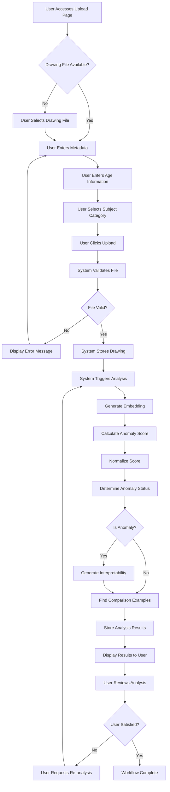
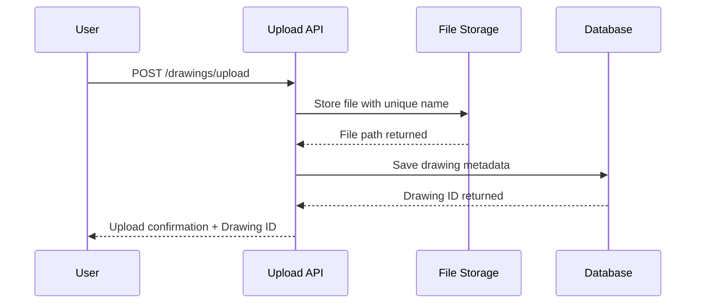
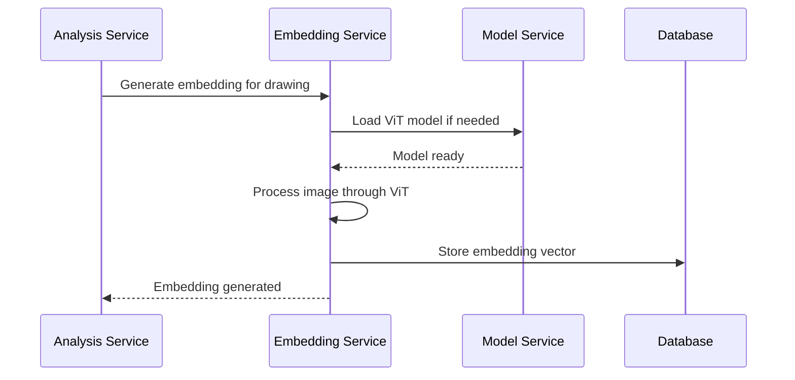
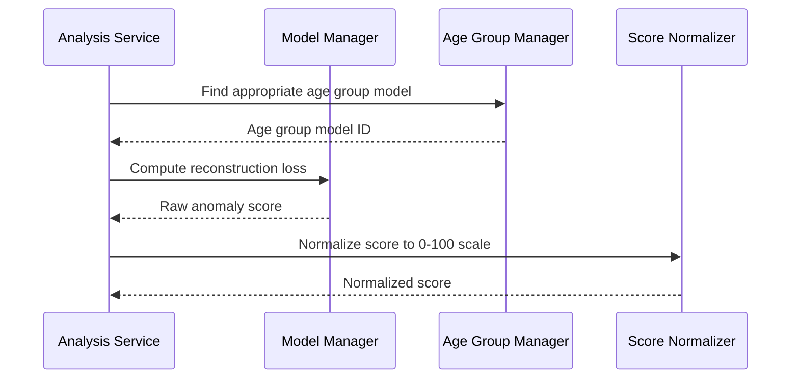
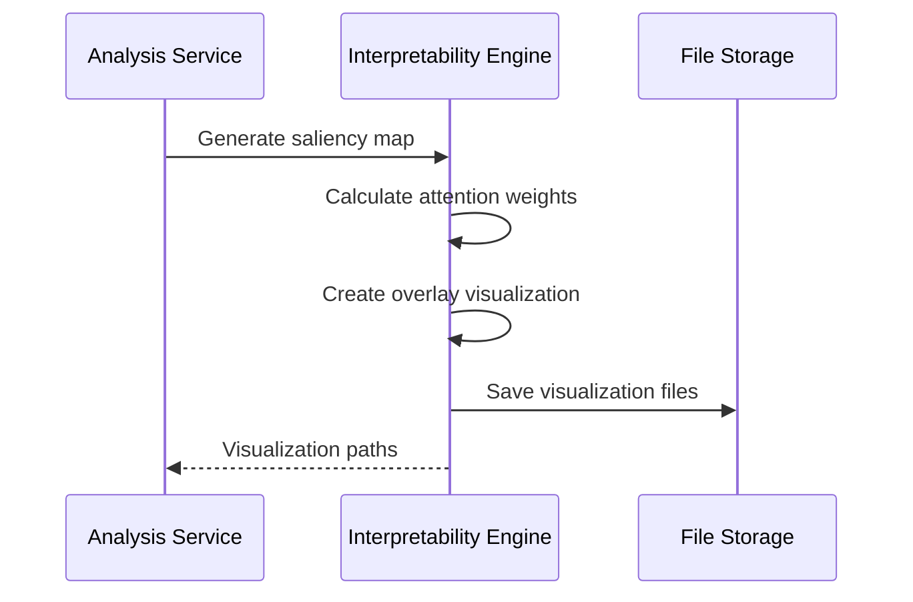
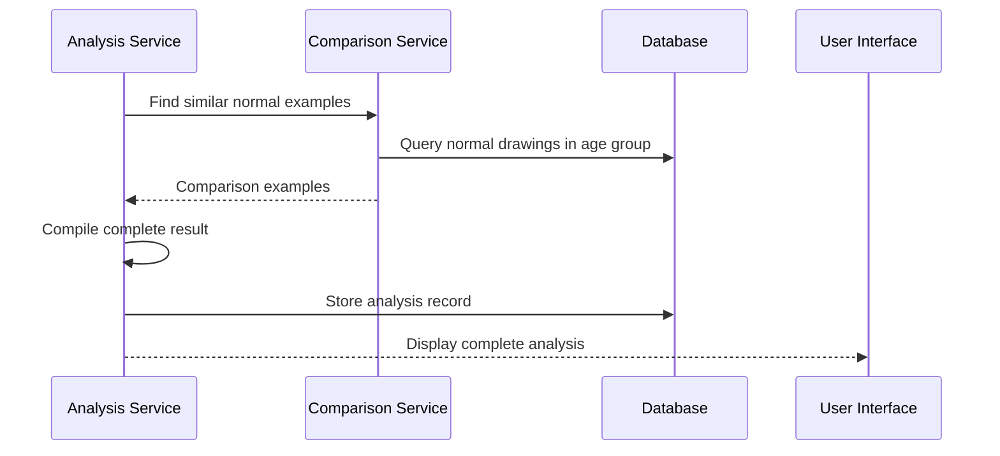

# Drawing Upload and Analysis Workflow

## Overview

This document describes the complete business workflow for uploading a drawing and receiving analysis results, from the user's perspective through to system completion.

## BPMN 2.0 Process Diagram

## Detailed Process Steps

### Phase 1: User Input and Validation

#### Step 1.1: File Selection
- **Actor**: User (Researcher/Educator/Healthcare Provider)
- **Action**: Navigate to upload page and select drawing file
- **Validation**: Client-side file type validation (PNG, JPEG, BMP)
- **Error Handling**: Display supported formats if invalid file selected

#### Step 1.2: Metadata Entry
- **Required Fields**:
  - Age (years): Numeric input with validation (0.5 - 18.0)
  - Subject: Dropdown selection (Person, House, Tree, Animal, Abstract, Other)
- **Optional Fields**:
  - Expert Label: Professional assessment if available
  - Notes: Additional context or observations
- **Validation Rules**:
  - Age must be within supported range
  - Subject must be from predefined list

#### Step 1.3: Upload Submission
- **Trigger**: User clicks "Upload and Analyze" button
- **Pre-submission Validation**:
  - File size check (max 10MB)
  - Required fields completion
  - File format verification

### Phase 2: System Processing

#### Step 2.1: File Storage

**Technical Details**:
- File stored with UUID-based filename
- Metadata stored in `drawings` table
- Atomic operation ensures consistency

#### Step 2.2: Automatic Analysis Trigger
- **Trigger**: Successful upload completion
- **Process**: Background analysis initiation
- **User Feedback**: Real-time status updates via WebSocket or polling

### Phase 3: ML Analysis Pipeline

#### Step 3.1: Embedding Generation

**Performance Metrics**:
- Embedding generation: ~2-5 seconds
- Model loading (cold start): ~10-15 seconds
- Model loading (warm): ~0.1 seconds

#### Step 3.2: Anomaly Score Calculation

**Algorithm Steps**:
1. Age group model selection based on drawing age
2. Reconstruction loss calculation using autoencoder
3. Percentile-based normalization within age group
4. Threshold comparison for anomaly determination

#### Step 3.3: Interpretability Generation (If Anomaly)

**Conditional Logic**:
- Interpretability generated only for anomalous drawings
- Reduces computational overhead for normal cases
- Provides visual explanations for concerning findings

### Phase 4: Result Presentation

#### Step 4.1: Comparison Examples
- **Purpose**: Provide context for analysis results
- **Selection Criteria**: 
  - Same age group as analyzed drawing
  - Classified as normal (non-anomalous)
  - High similarity based on embedding distance
- **Limit**: Maximum 3 comparison examples

#### Step 4.2: Result Compilation

### Phase 5: User Review and Actions

#### Step 5.1: Result Display
- **Analysis Summary**:
  - Anomaly score (0-100 scale)
  - Anomaly classification (Normal/Anomalous)
  - Confidence level
  - Age group used for comparison

- **Visual Elements**:
  - Original drawing display
  - Saliency map (if anomalous)
  - Comparison examples with similarity scores

#### Step 5.2: User Actions
- **View Details**: Expand analysis explanation
- **Download Results**: Export analysis report
- **Re-analyze**: Force re-analysis with different parameters
- **Save to Collection**: Add to user's saved analyses

## Business Rules

### File Validation Rules
1. **Supported Formats**: PNG, JPEG, BMP only
2. **File Size Limit**: Maximum 10MB per file
3. **Image Dimensions**: Minimum 32x32 pixels, maximum 4096x4096 pixels
4. **Age Range**: 0.5 to 18.0 years supported

### Analysis Rules
1. **Age Group Assignment**: Automatic based on provided age
2. **Model Selection**: Age-appropriate autoencoder model
3. **Threshold Application**: Age-group specific thresholds
4. **Interpretability Trigger**: Generated only for anomalous results

### Performance Expectations
1. **Upload Response**: < 5 seconds for file storage
2. **Analysis Completion**: < 30 seconds for complete analysis
3. **Result Display**: < 2 seconds for result rendering
4. **System Availability**: 99.5% uptime target

## Error Handling Scenarios

### User Input Errors
- **Invalid File Format**: Clear error message with supported formats
- **File Too Large**: Size limit notification with compression suggestions
- **Missing Required Fields**: Field-specific validation messages
- **Invalid Age Range**: Age limit explanation and valid range display

### System Processing Errors
- **Model Loading Failure**: Retry mechanism with fallback notification
- **Analysis Timeout**: Graceful degradation with partial results
- **Storage Failure**: Error recovery with user retry option
- **Network Issues**: Offline capability with sync when reconnected

### Recovery Procedures
1. **Automatic Retry**: Up to 3 attempts for transient failures
2. **Graceful Degradation**: Partial results when possible
3. **User Notification**: Clear error messages with next steps
4. **Support Escalation**: Contact information for persistent issues

## Success Metrics

### User Experience Metrics
- **Upload Success Rate**: > 99% of valid uploads complete successfully
- **Analysis Completion Rate**: > 98% of analyses complete within SLA
- **User Satisfaction**: Measured through feedback and usage patterns

### System Performance Metrics
- **Response Time**: 95th percentile under performance targets
- **Throughput**: Support for concurrent user sessions
- **Resource Utilization**: Efficient use of computational resources

### Quality Metrics
- **Analysis Accuracy**: Validated against expert assessments
- **Consistency**: Reproducible results for identical inputs
- **Interpretability Quality**: Meaningful visual explanations